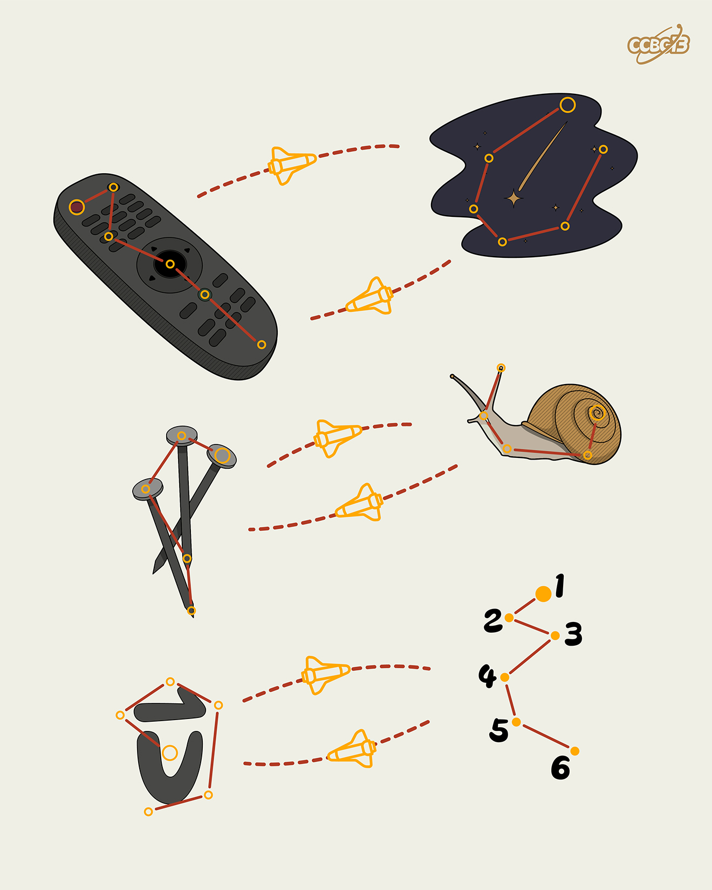

# ⭐

## 题面

## 答案

`COVERT`

## 解析

_官方存档未填写解析。_

## 提示

### 1. 题目里的图片分别对应什么单词？

REMOTE, METEOR, NAILS, SNAIL, VECTOR

## 本地附件

- [30fed6c924c841378c2b4728f51ceaf1.webp](../../../assets/archive.cipherpuzzles.com/ccbc13/images/asteroid/30fed6c924c841378c2b4728f51ceaf1.webp)

来源：[https://archive.cipherpuzzles.com/ccbc13/problems/asteroid/105.yaml](https://archive.cipherpuzzles.com/ccbc13/problems/asteroid/105.yaml)
