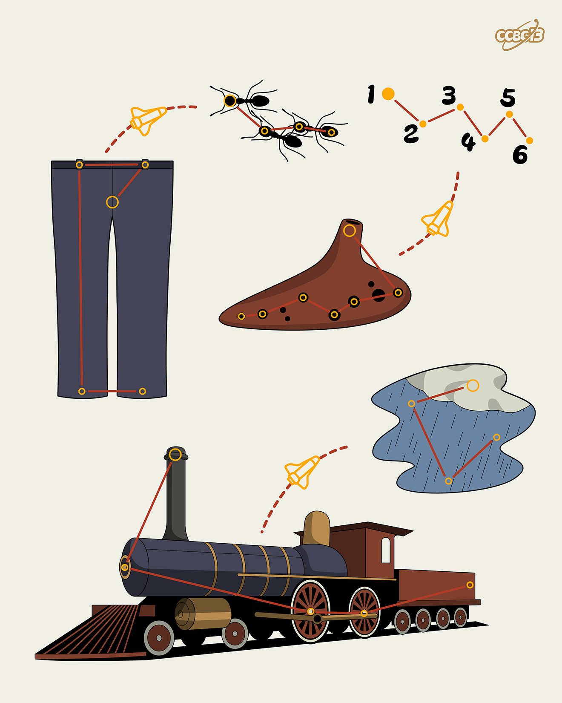

# ⭐

## 题面

## 答案

`CARINA`

## 解析

_官方存档未填写解析。_

## 提示

### 1. 题目里的图片分别对应什么单词？

ANTS, PANTS, OCARINA, RAIN, TRAIN

## 本地附件

- [63a8439ecbfe42599215853cc70d4f61.webp](../../../assets/archive.cipherpuzzles.com/ccbc13/images/asteroid/63a8439ecbfe42599215853cc70d4f61.webp)

来源：[https://archive.cipherpuzzles.com/ccbc13/problems/asteroid/106.yaml](https://archive.cipherpuzzles.com/ccbc13/problems/asteroid/106.yaml)
