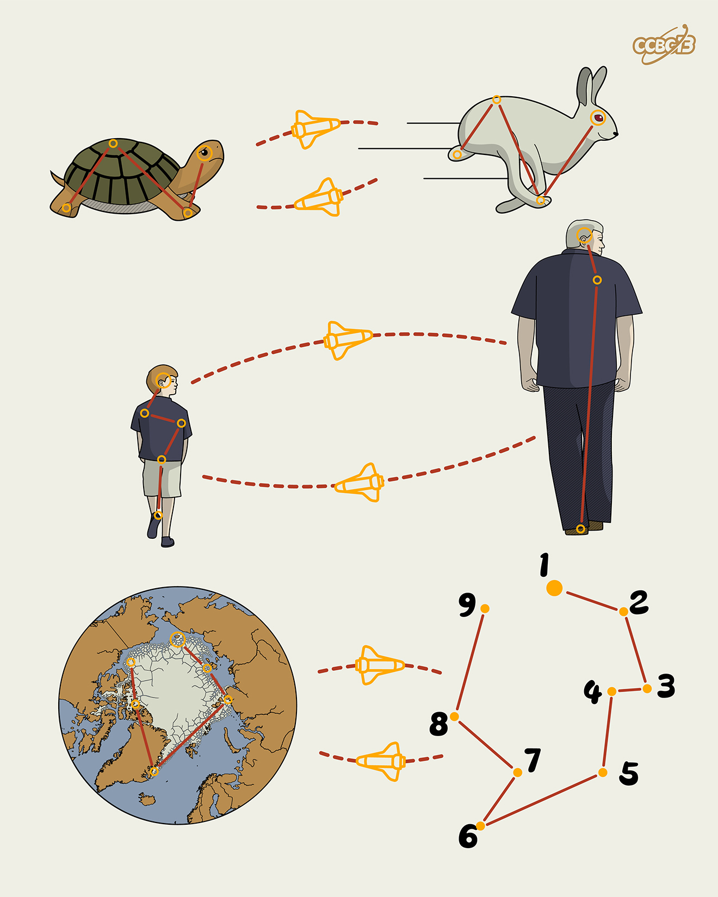

# ⭐

## 题面

## 答案

`ANTARCTIC`

## 解析

_官方存档未填写解析。_

## 提示

### 1. 题目里的图片分别对应什么单词？

SLOW, FAST, YOUNG, OLD, ARCTIC

## 本地附件

- [e364872e54674690a989f49307c08f03.webp](../../../assets/archive.cipherpuzzles.com/ccbc13/images/asteroid/e364872e54674690a989f49307c08f03.webp)

来源：[https://archive.cipherpuzzles.com/ccbc13/problems/asteroid/107.yaml](https://archive.cipherpuzzles.com/ccbc13/problems/asteroid/107.yaml)
