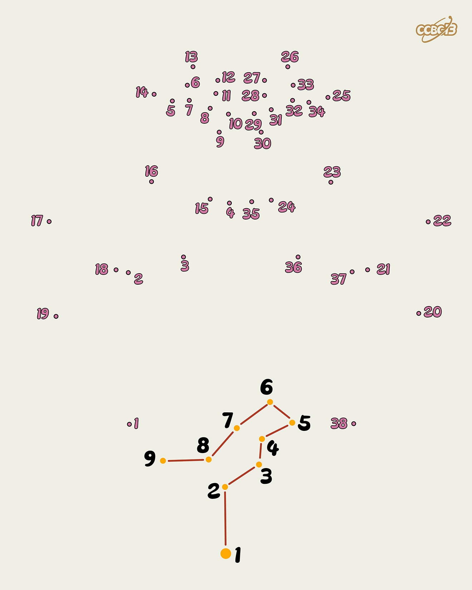

# ⭐

## 题面

## 答案

`FLAMINGOS`

## 解析

_官方存档未填写解析。_

## 提示

### 1. 这题要做什么？

将给出的点按照顺序连接起来，会得到一种粉红色的生物。

## 本地附件

- [2f75557735634d79b083e701b7034ebc.webp](../../../assets/archive.cipherpuzzles.com/ccbc13/images/asteroid/2f75557735634d79b083e701b7034ebc.webp)

来源：[https://archive.cipherpuzzles.com/ccbc13/problems/asteroid/108.yaml](https://archive.cipherpuzzles.com/ccbc13/problems/asteroid/108.yaml)
