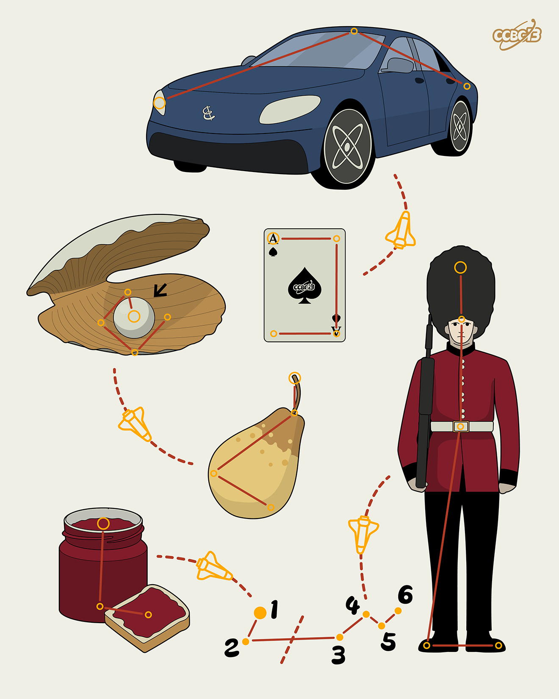

# ⭐

## 题面

## 答案

`JAGUAR`

## 解析

_官方存档未填写解析。_

## 提示

### 1. 题目里的图片分别对应什么单词？

CAR, CARD, PEARL, PEAR, JAM, GUARD

## 本地附件

- [a765dc9276864ef5aba3be029ce62278.webp](../../../assets/archive.cipherpuzzles.com/ccbc13/images/asteroid/a765dc9276864ef5aba3be029ce62278.webp)

来源：[https://archive.cipherpuzzles.com/ccbc13/problems/asteroid/109.yaml](https://archive.cipherpuzzles.com/ccbc13/problems/asteroid/109.yaml)
