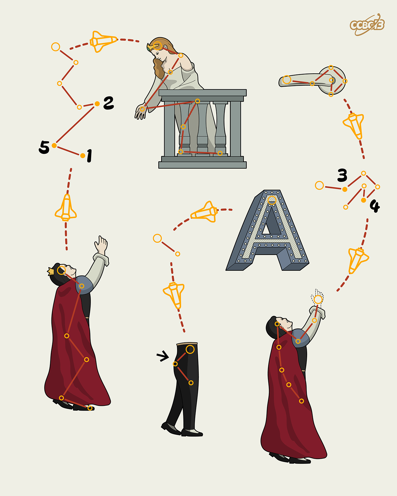

# ⭐

## 题面

## 答案

`SCALE`

## 解析

_官方存档未填写解析。_

## 提示

### 1. 题目里的图片分别对应什么单词？

PRINCESS, HANDLE, A, PRINCE, ASS, HANDLESS

## 本地附件

- [537f8a4d3cbe49b5bf2ad6d8a377c12c.webp](../../../assets/archive.cipherpuzzles.com/ccbc13/images/asteroid/537f8a4d3cbe49b5bf2ad6d8a377c12c.webp)

来源：[https://archive.cipherpuzzles.com/ccbc13/problems/asteroid/110.yaml](https://archive.cipherpuzzles.com/ccbc13/problems/asteroid/110.yaml)
