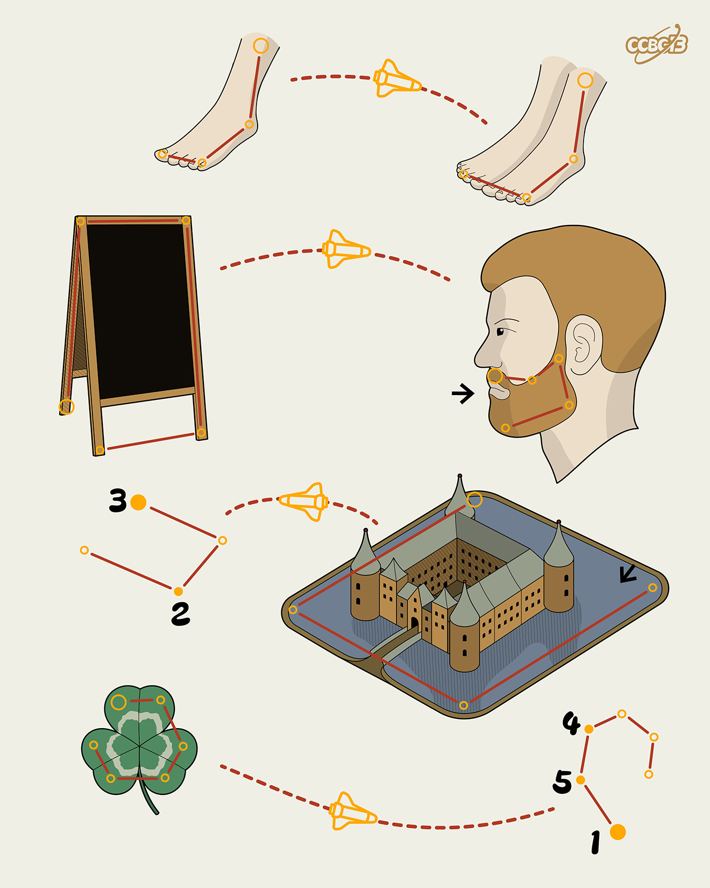

# ⭐

## 题面

## 答案

`CAMEL`

## 解析

_官方存档未填写解析。_

## 提示

### 1. 题目里的图片分别对应什么单词？

FOOT, FEET, BOARD, BEARD, MOAT, CLOVER

## 本地附件

- [1928dc52036344559a5f6be14be367e1.webp](../../../assets/archive.cipherpuzzles.com/ccbc13/images/asteroid/1928dc52036344559a5f6be14be367e1.webp)

来源：[https://archive.cipherpuzzles.com/ccbc13/problems/asteroid/111.yaml](https://archive.cipherpuzzles.com/ccbc13/problems/asteroid/111.yaml)
