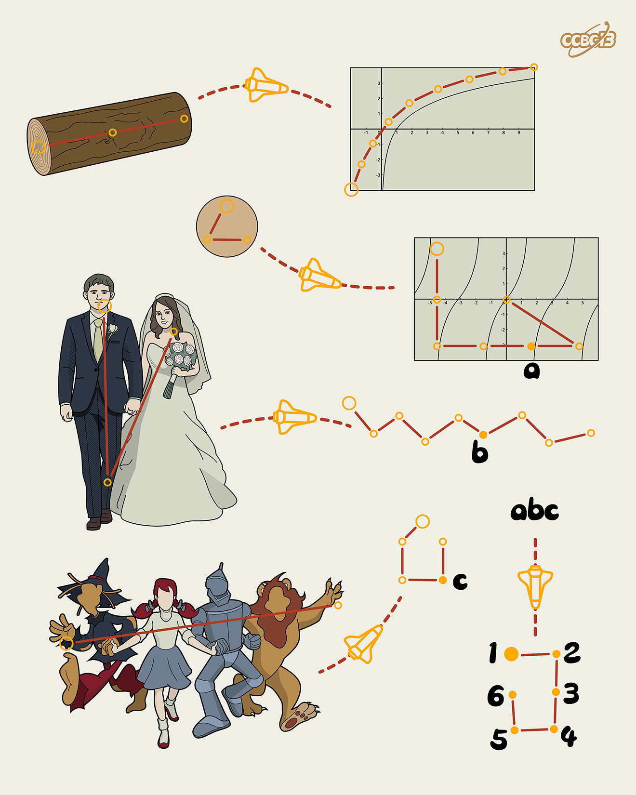

# ⭐

## 题面

## 答案

`ESCAPE`

## 解析

_官方存档未填写解析。_

## 提示

### 1. 题目里的图片分别对应什么单词？

LOG, LOGARITHM, TAN, TANGENT, WED, OZ

## 本地附件

- [955907c3053e4cb3b55adb6c8ba46305.webp](../../../assets/archive.cipherpuzzles.com/ccbc13/images/asteroid/955907c3053e4cb3b55adb6c8ba46305.webp)

来源：[https://archive.cipherpuzzles.com/ccbc13/problems/asteroid/112.yaml](https://archive.cipherpuzzles.com/ccbc13/problems/asteroid/112.yaml)
