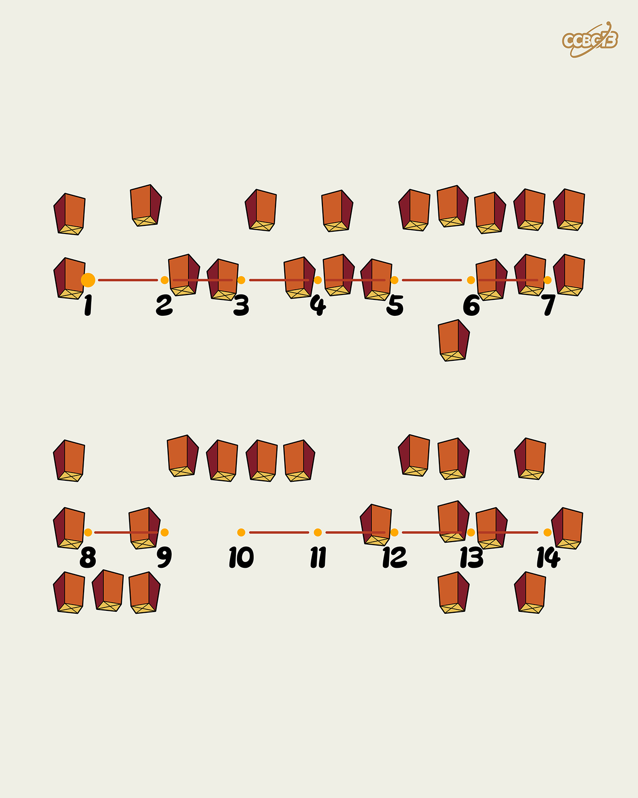

# ⭐

## 题面

## 答案

`BEIJING VS CAIRO`

## 解析

_官方存档未填写解析。_

## 提示

### 1. 我毫无思路

本题是盲文

## 本地附件

- [8df213e820ab47afabb312936cdb308c.webp](../../../assets/archive.cipherpuzzles.com/ccbc13/images/asteroid/8df213e820ab47afabb312936cdb308c.webp)

来源：[https://archive.cipherpuzzles.com/ccbc13/problems/asteroid/113.yaml](https://archive.cipherpuzzles.com/ccbc13/problems/asteroid/113.yaml)
