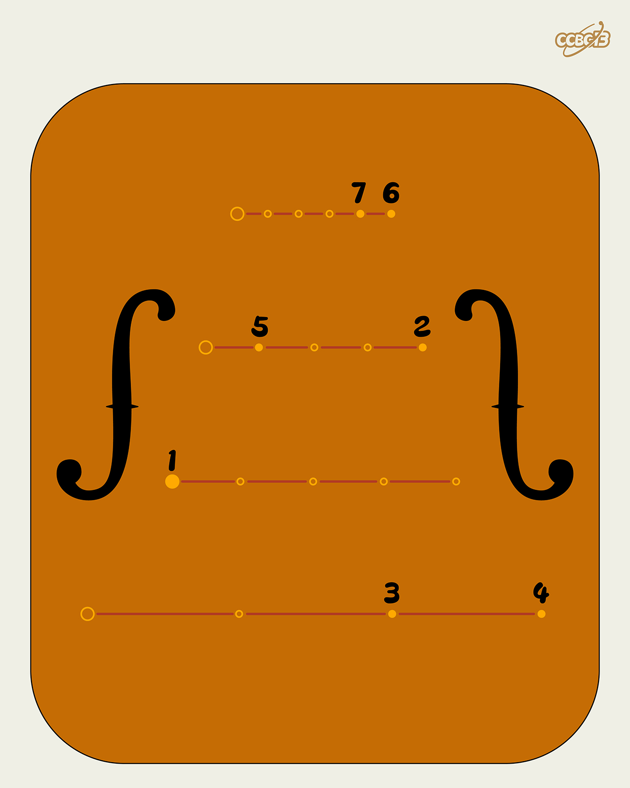

# ⭐

## 题面

## 答案

`CASSINI`

## 解析

_官方存档未填写解析。_

## 提示

### 1. 我毫无思路

填入不同种类提琴的英文单词

## 本地附件

- [d85d42a66d484ba7bc8a4d9d91cc1314.webp](../../../assets/archive.cipherpuzzles.com/ccbc13/images/asteroid/d85d42a66d484ba7bc8a4d9d91cc1314.webp)

来源：[https://archive.cipherpuzzles.com/ccbc13/problems/asteroid/114.yaml](https://archive.cipherpuzzles.com/ccbc13/problems/asteroid/114.yaml)
