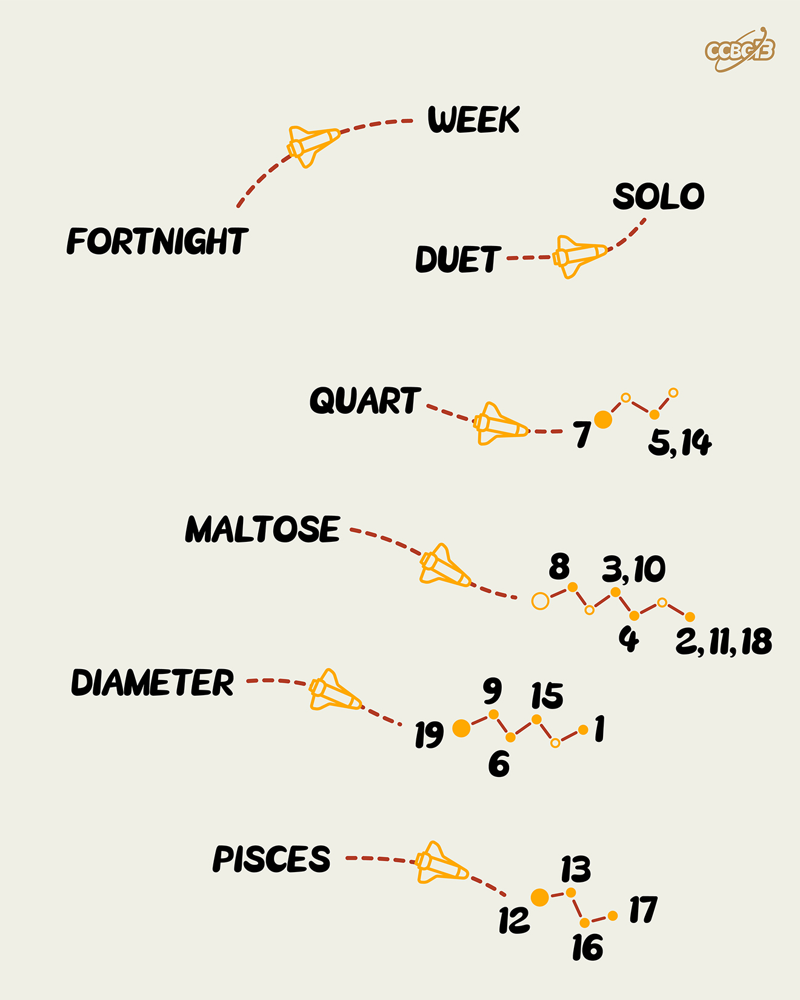

# ⭐

## 题面

## 答案

`SECOND PLACE FINISHER`

## 解析

_官方存档未填写解析。_

## 提示

### 1. 我毫无思路

本题的机制为减半

## 本地附件

- [80060869b18948a69fc9a6d4bf5136ca.webp](../../../assets/archive.cipherpuzzles.com/ccbc13/images/asteroid/80060869b18948a69fc9a6d4bf5136ca.webp)

来源：[https://archive.cipherpuzzles.com/ccbc13/problems/asteroid/115.yaml](https://archive.cipherpuzzles.com/ccbc13/problems/asteroid/115.yaml)
