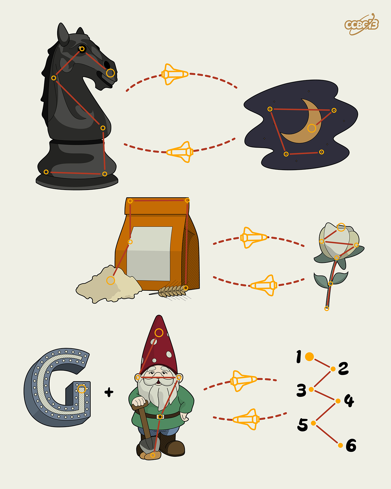

# ⭐

## 题面

## 答案

`GENOME`

## 解析

_官方存档未填写解析。_

## 提示

### 1. 每个图案代表什么英文单词？

KNIGHT, NIGHT, FLOUR, FLOWER, G, GNOME

## 本地附件

- [81ebfe2fd655423797752e4ef314ede0.webp](../../../assets/archive.cipherpuzzles.com/ccbc13/images/asteroid/81ebfe2fd655423797752e4ef314ede0.webp)

来源：[https://archive.cipherpuzzles.com/ccbc13/problems/asteroid/117.yaml](https://archive.cipherpuzzles.com/ccbc13/problems/asteroid/117.yaml)
