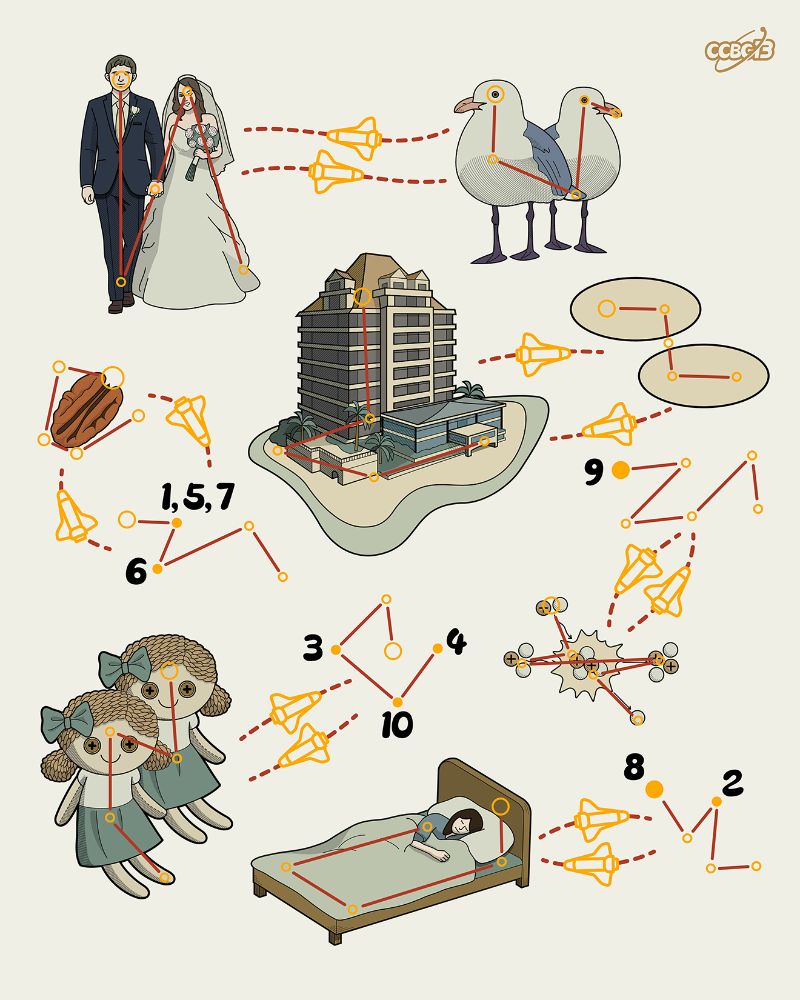

# ⭐

## 题面

## 答案

`INELIGIBLE`

## 解析

_官方存档未填写解析。_

## 提示

### 1. 题目里的图片分别对应什么单词？

MARRY
GULLS
HOTEL
OVALS
PECAN
DOLLS
FUSION
SLEEP

### 2. 我还是不懂箭头的机制

凯撒移位

## 本地附件

- [fedd05b9a6774adfaed1ef9543f84e53.webp](../../../assets/archive.cipherpuzzles.com/ccbc13/images/asteroid/fedd05b9a6774adfaed1ef9543f84e53.webp)

来源：[https://archive.cipherpuzzles.com/ccbc13/problems/asteroid/118.yaml](https://archive.cipherpuzzles.com/ccbc13/problems/asteroid/118.yaml)
