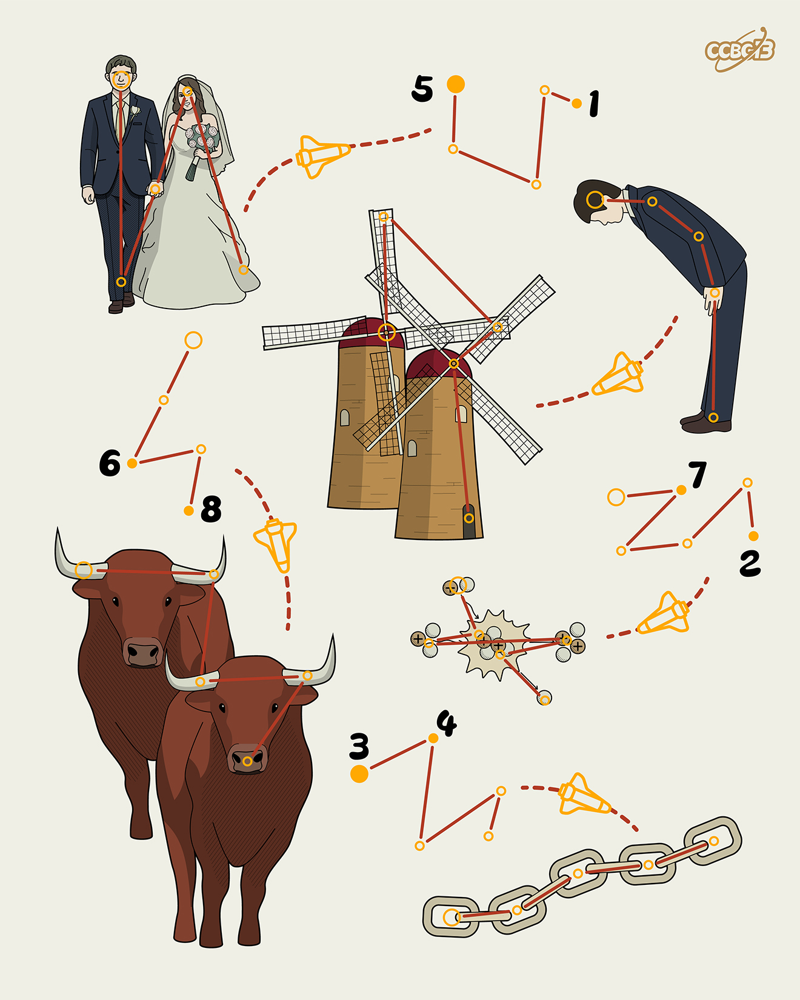

# ⭐

## 题面

## 答案

`STINGRAY`

## 解析

_官方存档未填写解析。_

## 提示

### 1. 题目里的图片分别对应什么单词？

MARRY
MILLS
SORRY
BULLS
FUSION
CHAIN

### 2. 我还是不懂箭头的机制

一个单词可以通过凯撒固定位数变为另一个单词。

## 本地附件

- [8676c9d8e4dd4c109b50946e336f5437.webp](../../../assets/archive.cipherpuzzles.com/ccbc13/images/asteroid/8676c9d8e4dd4c109b50946e336f5437.webp)

来源：[https://archive.cipherpuzzles.com/ccbc13/problems/asteroid/119.yaml](https://archive.cipherpuzzles.com/ccbc13/problems/asteroid/119.yaml)
