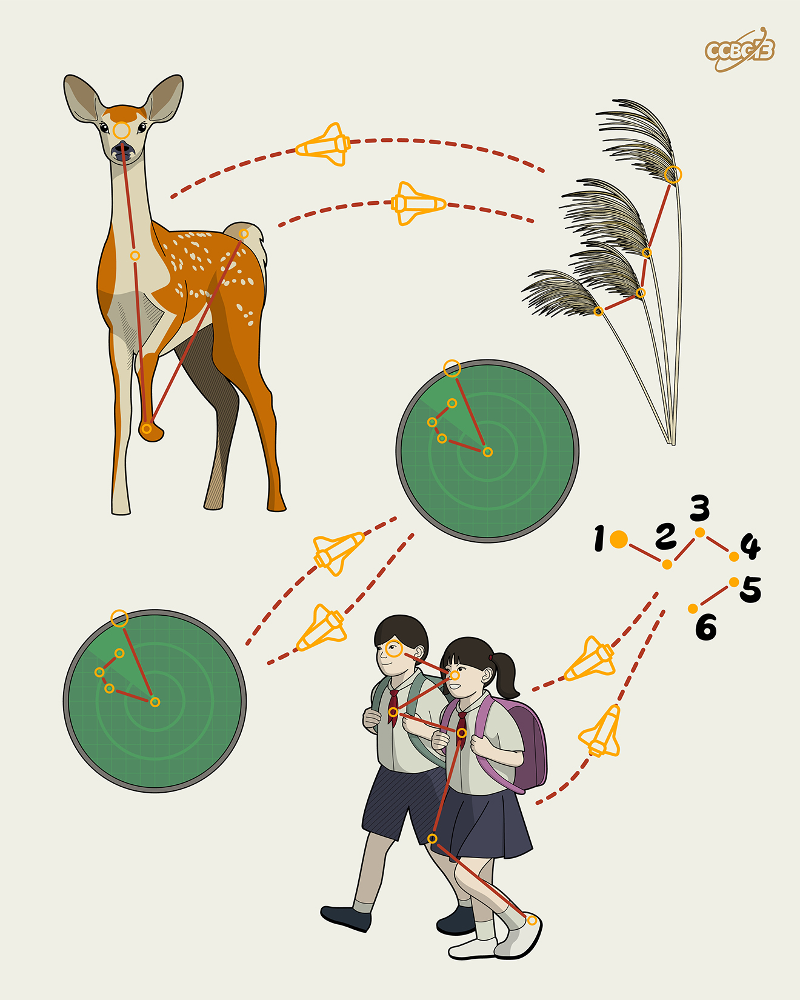

# ⭐

## 题面

## 答案

`SLIP UP`

## 解析

_官方存档未填写解析。_

## 提示

### 1. 题目里的图片分别对应什么单词？

DEER REED  
RADAR  
PUPILS

## 本地附件

- [24a7b6afdea6493da721f6f79e04339e.webp](../../../assets/archive.cipherpuzzles.com/ccbc13/images/asteroid/24a7b6afdea6493da721f6f79e04339e.webp)

来源：[https://archive.cipherpuzzles.com/ccbc13/problems/asteroid/120.yaml](https://archive.cipherpuzzles.com/ccbc13/problems/asteroid/120.yaml)
