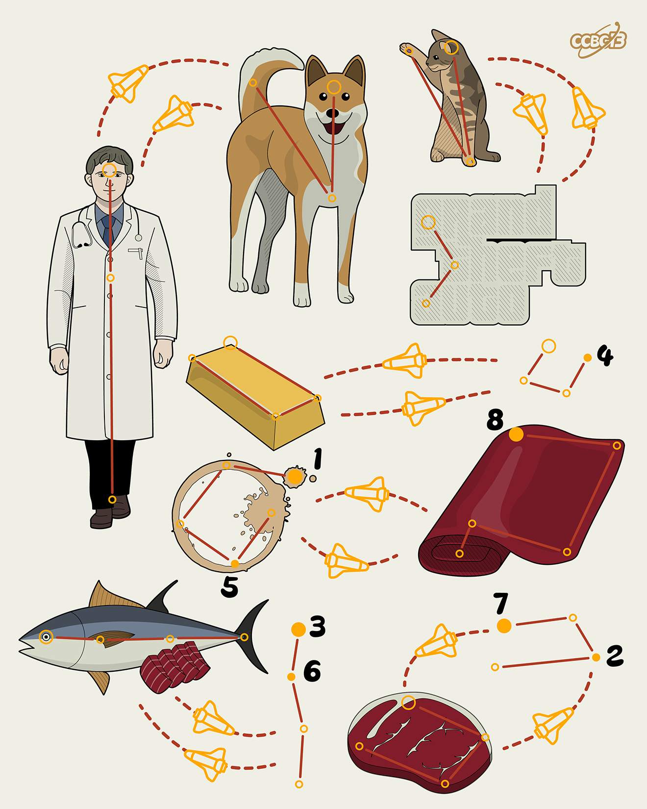

# ⭐

## 题面

## 答案

`STADIUMS`

## 解析

_官方存档未填写解析。_

## 提示

### 1. 题目里的图片分别对应什么单词？

DOG, CAT, GTA, DOC, GOLD, STAIN, SATIN,TUNA, MEAT

## 本地附件

- [27f92394cdc7437ebf612e8b8557678b.webp](../../../assets/archive.cipherpuzzles.com/ccbc13/images/asteroid/27f92394cdc7437ebf612e8b8557678b.webp)

来源：[https://archive.cipherpuzzles.com/ccbc13/problems/asteroid/121.yaml](https://archive.cipherpuzzles.com/ccbc13/problems/asteroid/121.yaml)
