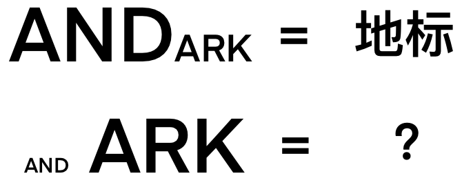

# ⭐️

## 题面

## 答案

`SAND LARK`

## 解析

_官方存档未填写解析。_

## 提示

### 1. 我毫无思路

地标的英文是 LANDMARK，而小、中、大分别是 S, M, L。

### 2. 字体的大小有什么用

注意大号、中号、小号往往用L、M、S表示。

## 本地附件

- [49877a89779c42f581bbe0fb95e98426.webp](../../../assets/archive.cipherpuzzles.com/ccbc13/images/asteroid/49877a89779c42f581bbe0fb95e98426.webp)

来源：[https://archive.cipherpuzzles.com/ccbc13/problems/asteroid/122.yaml](https://archive.cipherpuzzles.com/ccbc13/problems/asteroid/122.yaml)
