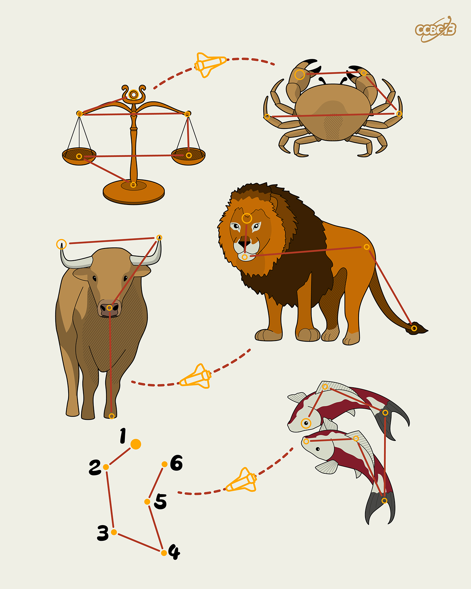

# ⭐

## 题面

## 答案

`ARCHER`

## 解析

_官方存档未填写解析。_

## 提示

### 1. 题目里的图片分别对应什么单词？

SCALES, CRAB, BULL, LION, FISHES

### 2. 我还是不知道这些东西对应什么

它们各代表十二星座之一

## 本地附件

- [dd41db10a56c402dafc34d052266f6bf.webp](../../../assets/archive.cipherpuzzles.com/ccbc13/images/asteroid/dd41db10a56c402dafc34d052266f6bf.webp)

来源：[https://archive.cipherpuzzles.com/ccbc13/problems/asteroid/123.yaml](https://archive.cipherpuzzles.com/ccbc13/problems/asteroid/123.yaml)
