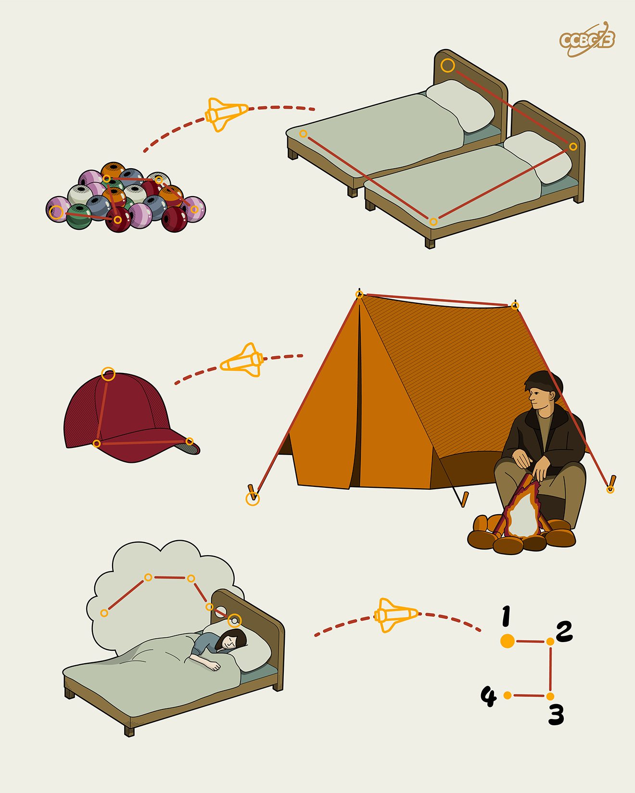

# ⭐

## 题面

## 答案

`DRAM`

## 解析

_官方存档未填写解析。_

## 提示

### 1. 题目里的图片分别对应什么单词？

BEADS, BEDS, CAP, CAMP, DREAM

## 本地附件

- [c906924017fc4077acf9d84e97ad2fb5.webp](../../../assets/archive.cipherpuzzles.com/ccbc13/images/asteroid/c906924017fc4077acf9d84e97ad2fb5.webp)

来源：[https://archive.cipherpuzzles.com/ccbc13/problems/asteroid/124.yaml](https://archive.cipherpuzzles.com/ccbc13/problems/asteroid/124.yaml)
