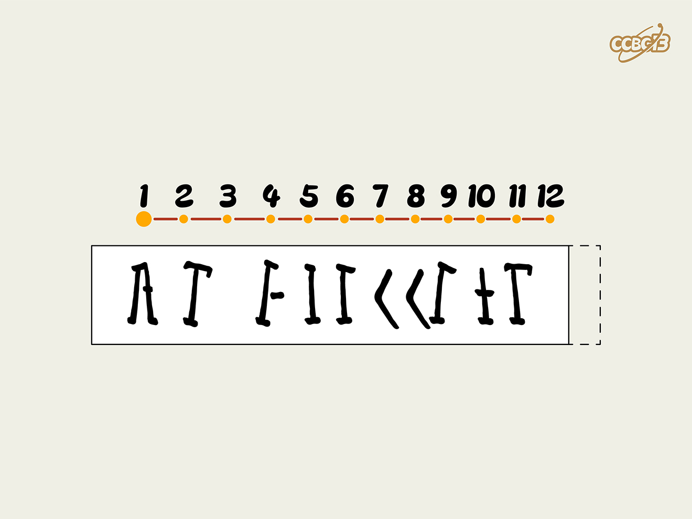

# ⭐

## 题面

## 答案

`ANTIAIRCRAFT`

## 解析

_官方存档未填写解析。_

## 提示

### 1. 我毫无思路

将图片平移后与原图片重叠

### 2. 我大概知道答案了，为什么不对？

最后的答案形式是(4-8)，第四个字母是I。

## 本地附件

- [8d0a6cde3ea94195b85de0b11738ba86.webp](../../../assets/archive.cipherpuzzles.com/ccbc13/images/asteroid/8d0a6cde3ea94195b85de0b11738ba86.webp)

来源：[https://archive.cipherpuzzles.com/ccbc13/problems/asteroid/125.yaml](https://archive.cipherpuzzles.com/ccbc13/problems/asteroid/125.yaml)
