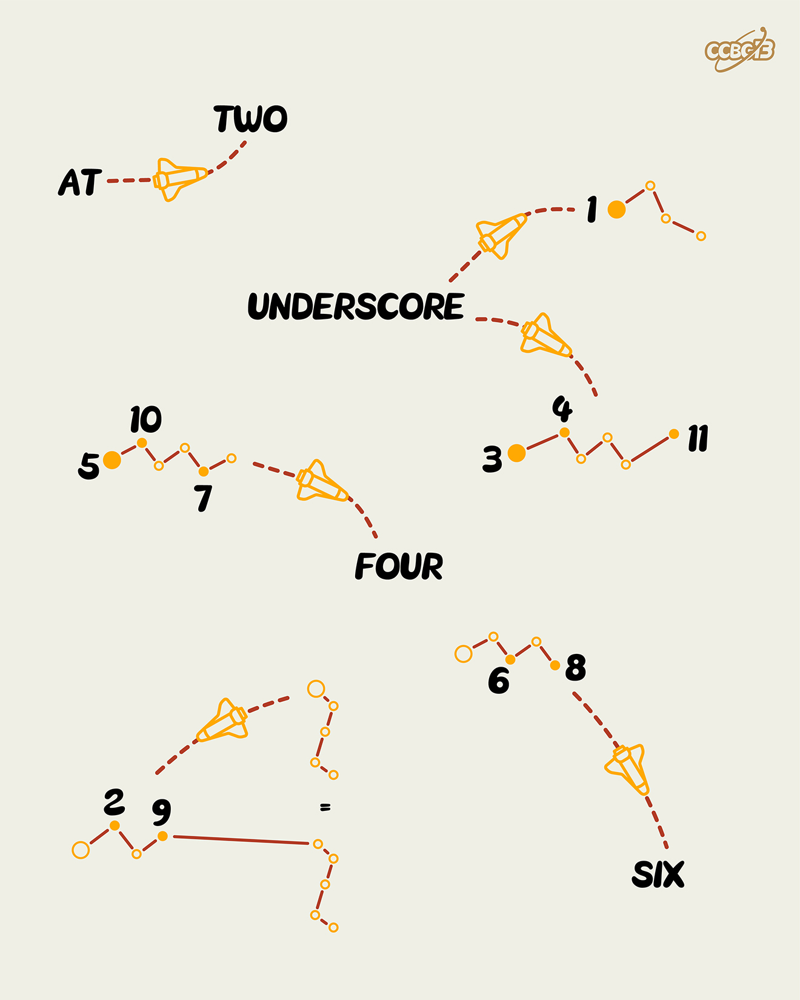

# ⭐

## 题面

## 答案

`DEHYDRATION`

## 解析

_官方存档未填写解析。_

## 提示

### 1. 我毫无思路

本题使用电脑键盘上的数字键以及其对应的特殊符号

## 本地附件

- [6ddff63cbaa54b188c59276fff835941.webp](../../../assets/archive.cipherpuzzles.com/ccbc13/images/asteroid/6ddff63cbaa54b188c59276fff835941.webp)

来源：[https://archive.cipherpuzzles.com/ccbc13/problems/asteroid/126.yaml](https://archive.cipherpuzzles.com/ccbc13/problems/asteroid/126.yaml)
