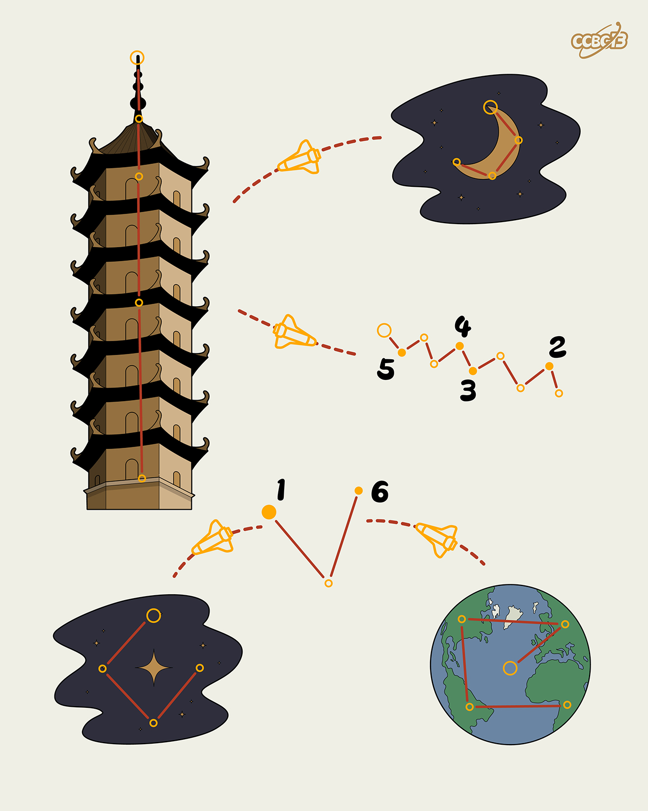

# ⭐

## 题面

## 答案

`SCREEN`

## 解析

_官方存档未填写解析。_

## 提示

### 1. 我毫无头绪

每个图代表塔罗牌里的一张大阿卡纳牌

### 2. 题目里的图片分别对应什么单词？

TOWER, MOON, STAR, WORLD

## 本地附件

- [ed40f8762e36417fb6689e7757b66a73.webp](../../../assets/archive.cipherpuzzles.com/ccbc13/images/asteroid/ed40f8762e36417fb6689e7757b66a73.webp)

来源：[https://archive.cipherpuzzles.com/ccbc13/problems/asteroid/127.yaml](https://archive.cipherpuzzles.com/ccbc13/problems/asteroid/127.yaml)
