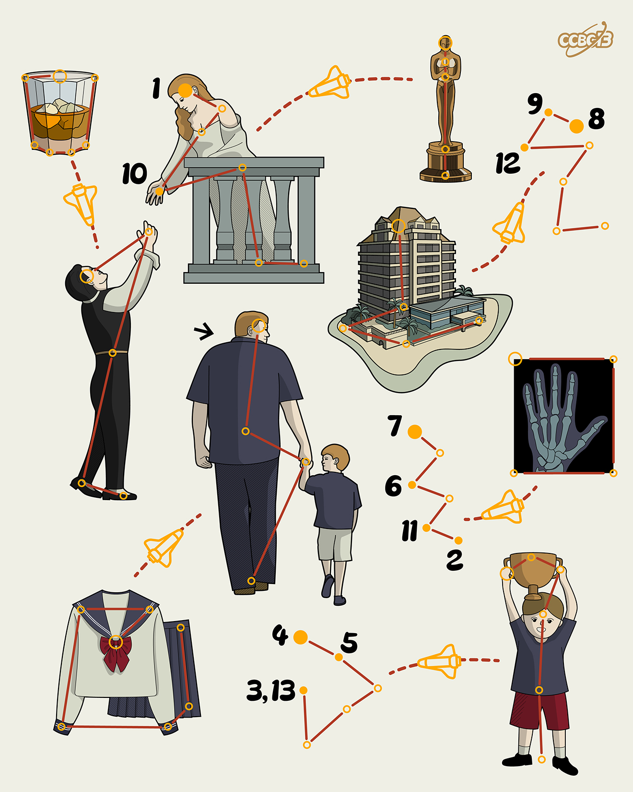

# ⭐

## 题面

## 答案

`JACQUES CHIRAC`

## 解析

_官方存档未填写解析。_

## 提示

### 1. 题目里的图片分别对应什么单词？

WHISKEY, JULIETT, OSCAR, HOTEL, ROMEO, PAPA, XRAY, UNIFORM, VICTOR

### 2. 不懂箭头（飞船）的意义

每一个图案对应一个NATO（北约音标）字母表里的单词，箭头代表在这个字母表里移动某个固定的位数。

## 本地附件

- [5a4ac8d9f8af4d749f38a5fe37b31a86.webp](../../../assets/archive.cipherpuzzles.com/ccbc13/images/asteroid/5a4ac8d9f8af4d749f38a5fe37b31a86.webp)

来源：[https://archive.cipherpuzzles.com/ccbc13/problems/asteroid/130.yaml](https://archive.cipherpuzzles.com/ccbc13/problems/asteroid/130.yaml)
