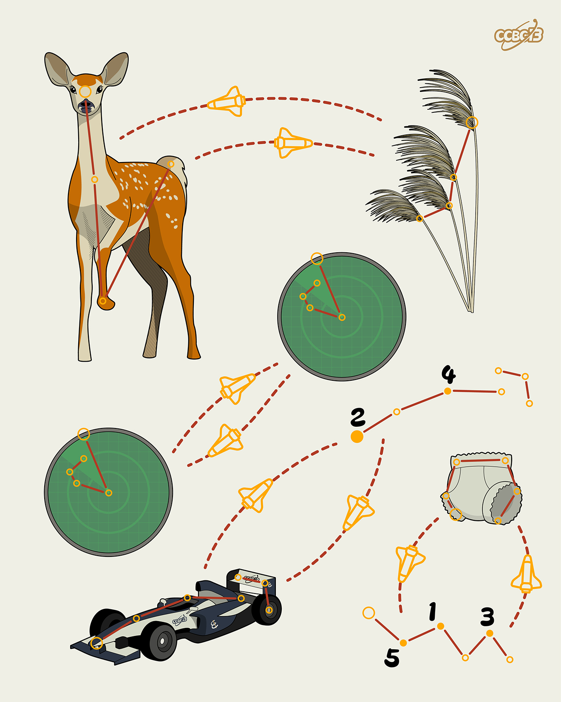

# ⭐

## 题面

## 答案

`PRICE`

## 解析

_官方存档未填写解析。_

## 提示

### 1. 题目里的图片分别对应什么单词？

DEER, REED, RADAR, RACECAR, DIAPER

## 本地附件

- [c6c7c39869f048c8b395772c5a07122c.webp](../../../assets/archive.cipherpuzzles.com/ccbc13/images/asteroid/c6c7c39869f048c8b395772c5a07122c.webp)

来源：[https://archive.cipherpuzzles.com/ccbc13/problems/asteroid/131.yaml](https://archive.cipherpuzzles.com/ccbc13/problems/asteroid/131.yaml)
