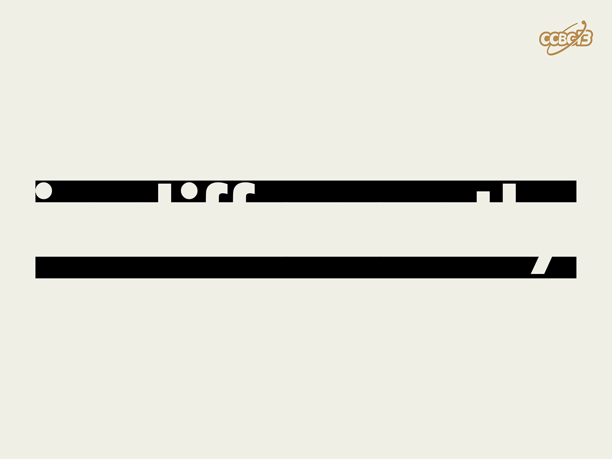

# ⭐️

## 题面

## 答案

`INDIFFERENTLY`

## 解析

_官方存档未填写解析。_

## 提示

### 1. 我毫无思路

图片是一个英文单词将中间部分删除后的结果

## 本地附件

- [565f53e4bb7547ce84a066700d6a1c02.webp](../../../assets/archive.cipherpuzzles.com/ccbc13/images/asteroid/565f53e4bb7547ce84a066700d6a1c02.webp)

来源：[https://archive.cipherpuzzles.com/ccbc13/problems/asteroid/132.yaml](https://archive.cipherpuzzles.com/ccbc13/problems/asteroid/132.yaml)
