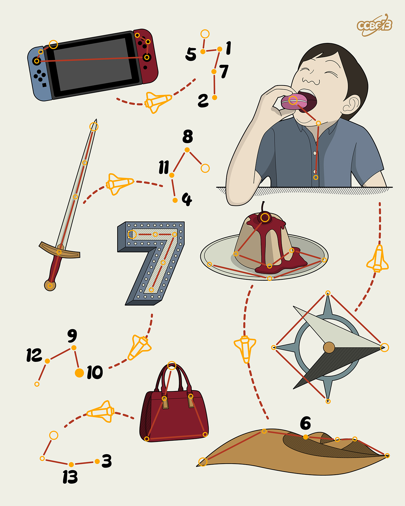

# ⭐

## 题面

## 答案

`THE DISCOVERER`

## 解析

_官方存档未填写解析。_

## 提示

### 1. 题目里的图片分别对应什么单词？

SWITCH, EAT, SWORD, SEVEN, DESSERT, EAST, PURSE, DESERT

## 本地附件

- [a418889424034a189595aa483e0d7443.webp](../../../assets/archive.cipherpuzzles.com/ccbc13/images/asteroid/a418889424034a189595aa483e0d7443.webp)

来源：[https://archive.cipherpuzzles.com/ccbc13/problems/asteroid/134.yaml](https://archive.cipherpuzzles.com/ccbc13/problems/asteroid/134.yaml)
