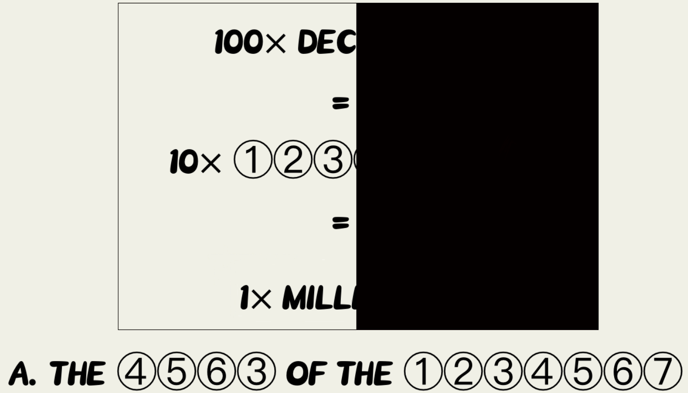

# ⭐

## 题面

## 答案

`THE TURN OF THE CENTURY`

## 解析

_官方存档未填写解析。_

## 提示

### 1. 我毫无思路

中间三行的单词分别对应三个描述时间跨度的单词

### 2. 知道最下面是什么了，然后怎么办？

直接把整行字提交即可。

## 本地附件

- [0e155d8d1af646378716fb7515da78e7.webp](../../../assets/archive.cipherpuzzles.com/ccbc13/images/asteroid/0e155d8d1af646378716fb7515da78e7.webp)

来源：[https://archive.cipherpuzzles.com/ccbc13/problems/asteroid/135.yaml](https://archive.cipherpuzzles.com/ccbc13/problems/asteroid/135.yaml)
