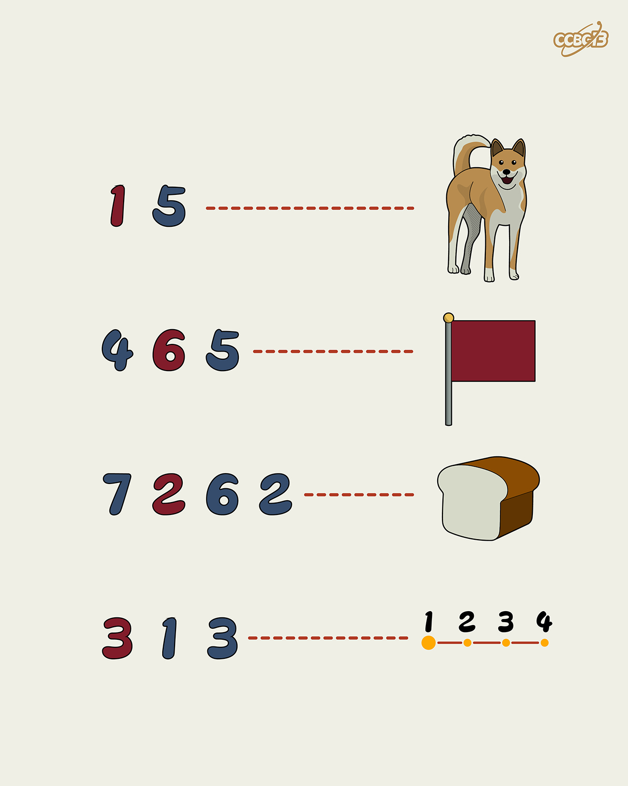

# ⭐

## 题面

## 答案

`MICE`

## 解析

_官方存档未填写解析。_

## 提示

### 1. 题目里的图片分别对应什么单词？

DOG, FLAG, BREAD

### 2. 我还是不懂数字什么意思

红蓝两种数字分别代表了七个音符的两种写法。

## 本地附件

- [f02ceb2149c846f1a9be5647a57b3c8b.webp](../../../assets/archive.cipherpuzzles.com/ccbc13/images/asteroid/f02ceb2149c846f1a9be5647a57b3c8b.webp)

来源：[https://archive.cipherpuzzles.com/ccbc13/problems/asteroid/136.yaml](https://archive.cipherpuzzles.com/ccbc13/problems/asteroid/136.yaml)
