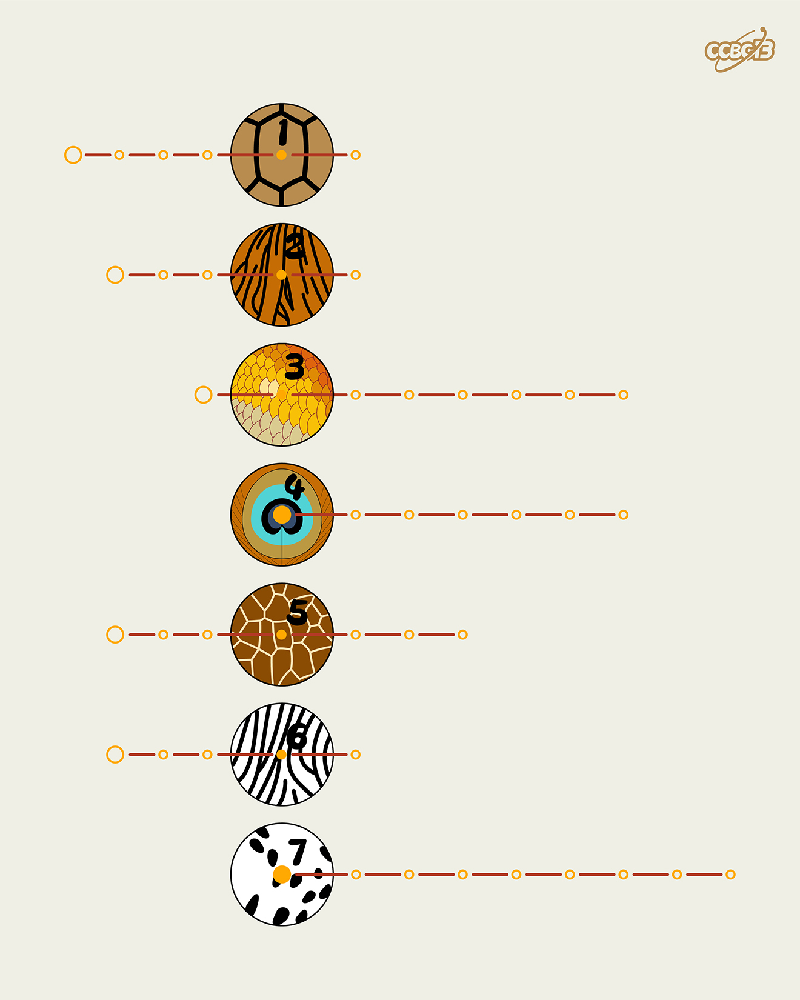

# ⭐️

## 题面

## 答案

`LEOPARD`

## 解析

_官方存档未填写解析。_

## 提示

### 1. 我毫无思路

每行对应一种动物的表皮

## 本地附件

- [0b0b3686e98449df8d4bc425c93d1315.webp](../../../assets/archive.cipherpuzzles.com/ccbc13/images/asteroid/0b0b3686e98449df8d4bc425c93d1315.webp)

来源：[https://archive.cipherpuzzles.com/ccbc13/problems/asteroid/138.yaml](https://archive.cipherpuzzles.com/ccbc13/problems/asteroid/138.yaml)
