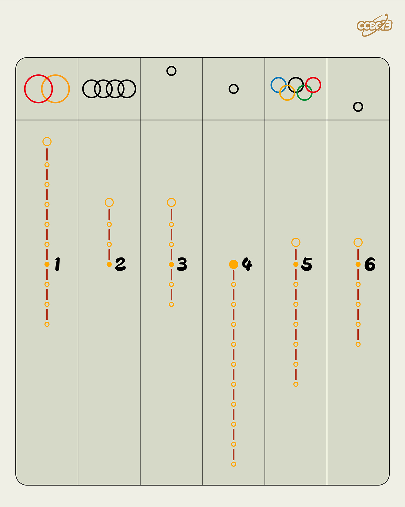

# ⭐

## 题面

## 答案

`CIRCLE`

## 解析

_官方存档未填写解析。_

## 提示

### 1. 我毫无思路

用英文描述上边的图片。有三个是常见Logo，另外三个是常用符号。

## 本地附件

- [688b40a3f4254fe180c3afcff19a7996.webp](../../../assets/archive.cipherpuzzles.com/ccbc13/images/asteroid/688b40a3f4254fe180c3afcff19a7996.webp)

来源：[https://archive.cipherpuzzles.com/ccbc13/problems/asteroid/140.yaml](https://archive.cipherpuzzles.com/ccbc13/problems/asteroid/140.yaml)
