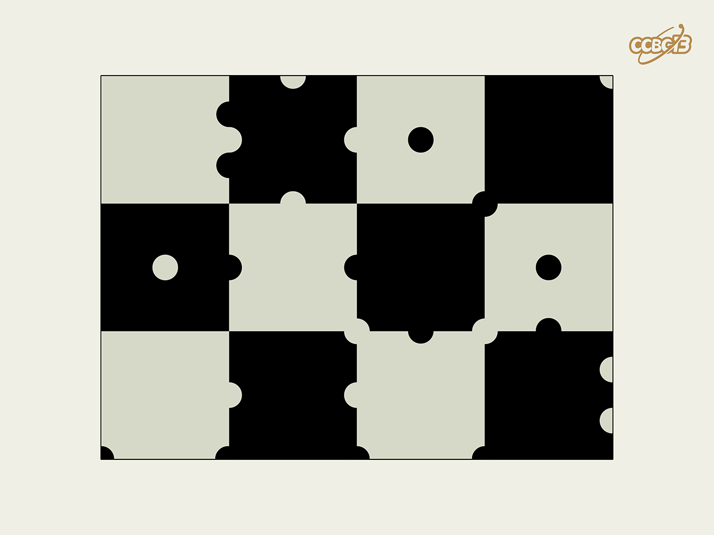

# ⭐️

## 题面

## 答案

`EXPLOITATIVE`

## 解析

_官方存档未填写解析。_

## 提示

### 1. 我毫无思路

看图读出字母，每格一个

## 本地附件

- [7fde355661a3400085ecf40321e58931.webp](../../../assets/archive.cipherpuzzles.com/ccbc13/images/asteroid/7fde355661a3400085ecf40321e58931.webp)

来源：[https://archive.cipherpuzzles.com/ccbc13/problems/asteroid/143.yaml](https://archive.cipherpuzzles.com/ccbc13/problems/asteroid/143.yaml)
