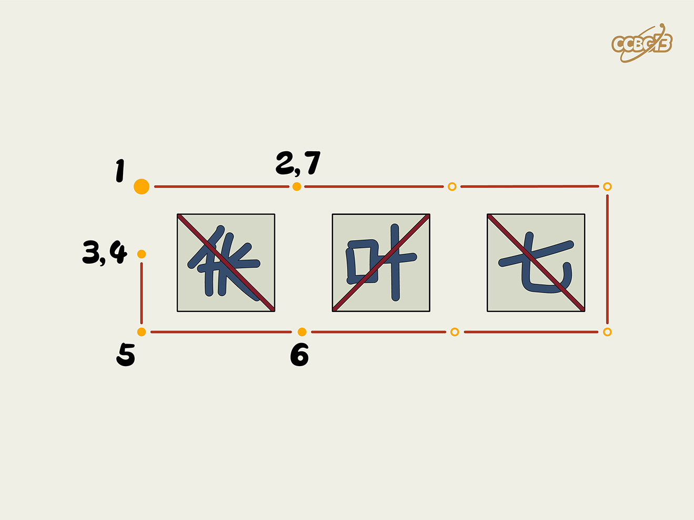

# ⭐️

## 题面

## 答案

`CHEETAH`

## 解析

_官方存档未填写解析。_

## 提示

### 1. 我毫无思路

把这些方格沿画的对角线反转

## 本地附件

- [aaa7e35a868f4075aace84fd2f9065e2.webp](../../../assets/archive.cipherpuzzles.com/ccbc13/images/asteroid/aaa7e35a868f4075aace84fd2f9065e2.webp)

来源：[https://archive.cipherpuzzles.com/ccbc13/problems/asteroid/148.yaml](https://archive.cipherpuzzles.com/ccbc13/problems/asteroid/148.yaml)
