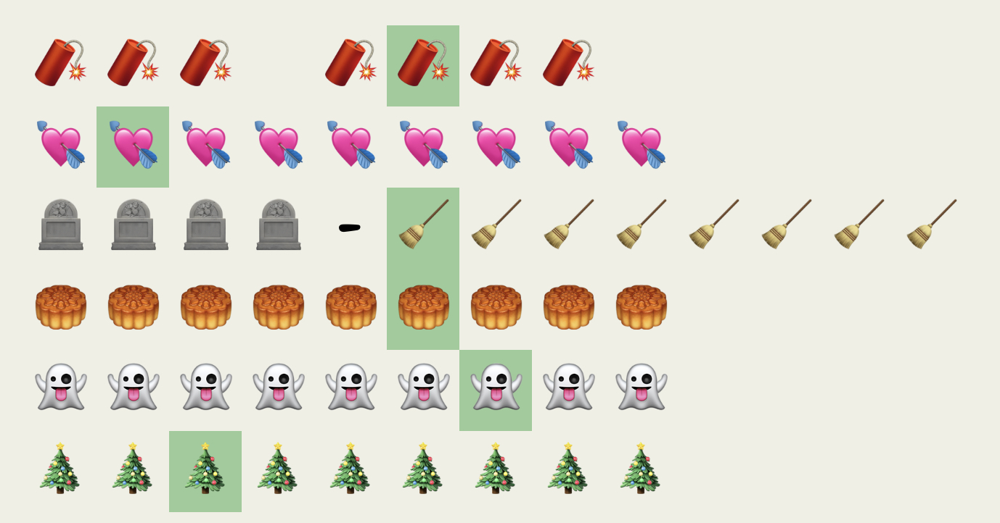

# ⭐

## 题面

## 答案

`EASTER`

## 解析

_官方存档未填写解析。_

## 提示

### 1. 我毫无思路

每行emoji都提示了某个中国或西方的传统节日

## 本地附件

- [6cc85102e0b147e0beaab054bc396ede.webp](../../../assets/archive.cipherpuzzles.com/ccbc13/images/asteroid/6cc85102e0b147e0beaab054bc396ede.webp)

来源：[https://archive.cipherpuzzles.com/ccbc13/problems/asteroid/149.yaml](https://archive.cipherpuzzles.com/ccbc13/problems/asteroid/149.yaml)
