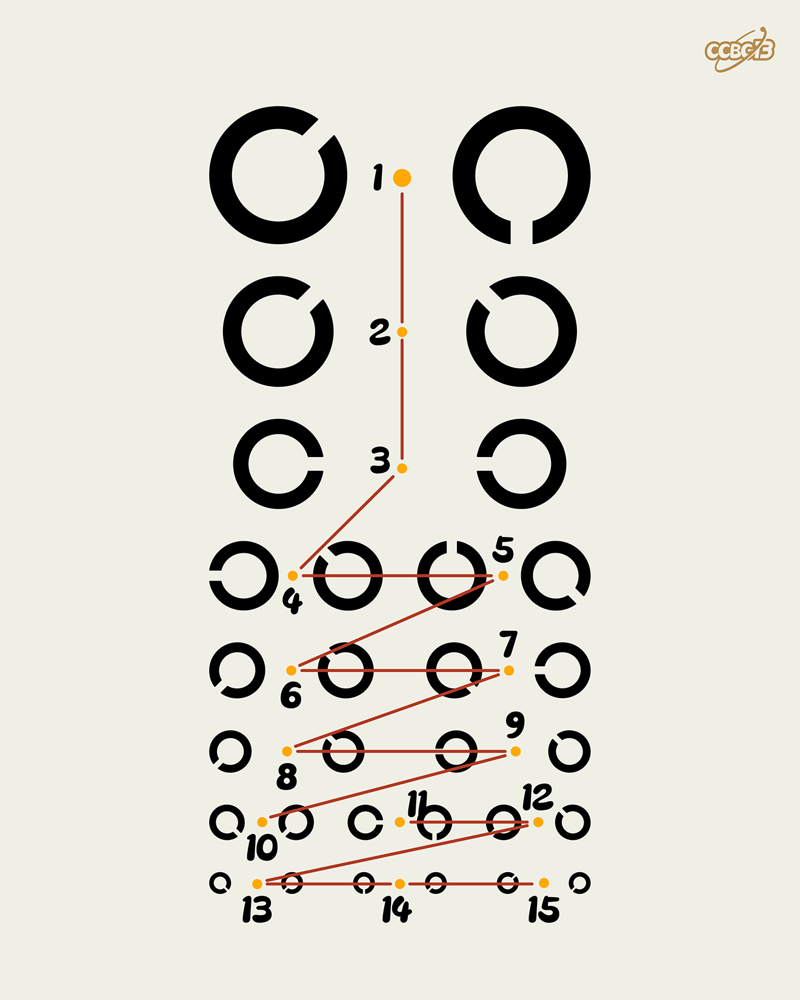

# ⭐

## 题面

## 答案

`EUROVISION FINAL`

## 解析

_官方存档未填写解析。_

## 提示

### 1. 我毫无思路

每一对符号可以转成一个双旗旗语

## 本地附件

- [64de783948f94ef5b63c86b8262ff133.webp](../../../assets/archive.cipherpuzzles.com/ccbc13/images/asteroid/64de783948f94ef5b63c86b8262ff133.webp)

来源：[https://archive.cipherpuzzles.com/ccbc13/problems/asteroid/150.yaml](https://archive.cipherpuzzles.com/ccbc13/problems/asteroid/150.yaml)
