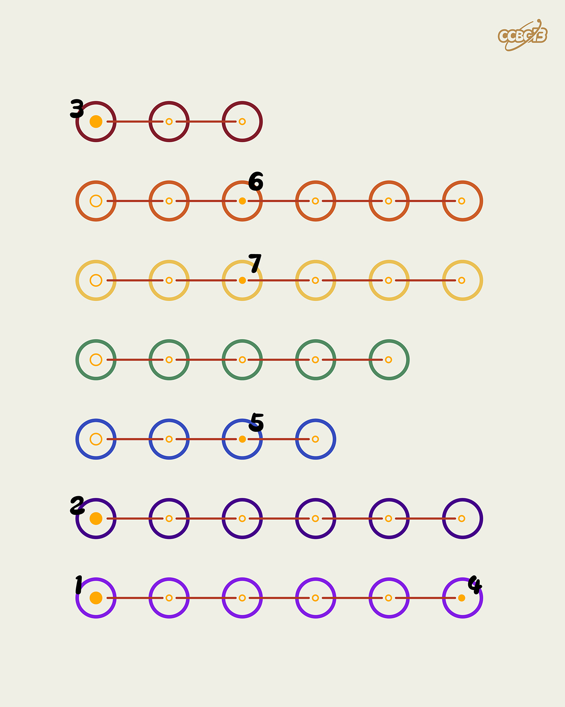

# ⭐

## 题面

## 答案

`VIRTUAL`

## 解析

_官方存档未填写解析。_

## 提示

### 1. 我毫无思路

注意七个颜色刚好是彩虹色，把颜色转成英文。

## 本地附件

- [12afac7c161542c098f27791b2842aaa.webp](../../../assets/archive.cipherpuzzles.com/ccbc13/images/asteroid/12afac7c161542c098f27791b2842aaa.webp)

来源：[https://archive.cipherpuzzles.com/ccbc13/problems/asteroid/151.yaml](https://archive.cipherpuzzles.com/ccbc13/problems/asteroid/151.yaml)
