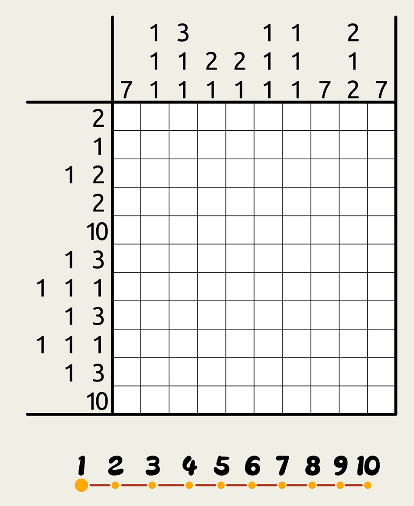
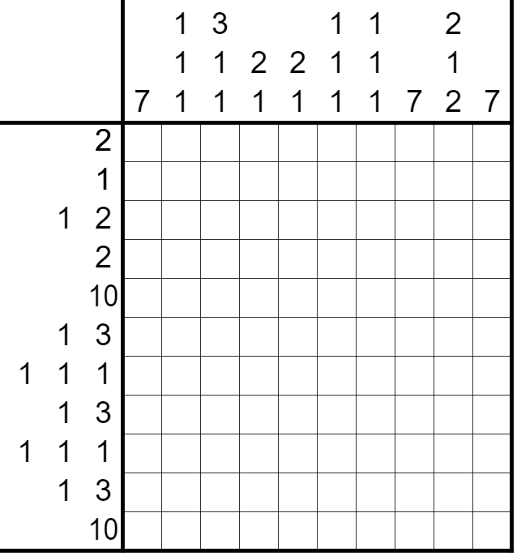
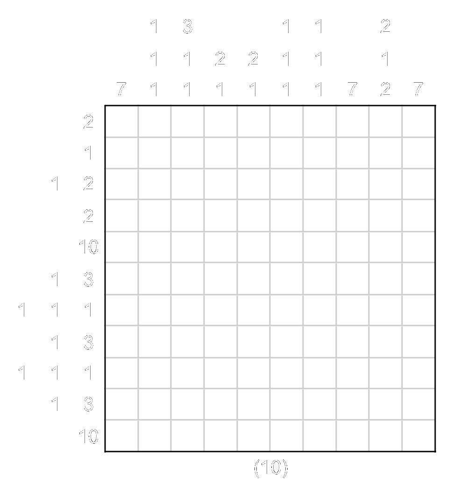

# ⭐

## 题面

点击图片以在网页上做题。

<!--

-->

## 答案

`TELEVISION`

## 解析

_官方存档未填写解析。_

## 提示

### 1. 该如何提取

象形。最终答案是一个常见电器。

## 本地附件

- [05b7b7b040b6490b9aa0b1ca9db096a8.webp](../../../assets/archive.cipherpuzzles.com/ccbc13/images/asteroid/05b7b7b040b6490b9aa0b1ca9db096a8.webp)
- [4564b00e74414ab5970b2e006ad600e2.webp](../../../assets/archive.cipherpuzzles.com/ccbc13/images/asteroid/4564b00e74414ab5970b2e006ad600e2.webp)
- [9c7974f8f951458ba4d9ea2c7f9df2d2.webp](../../../assets/archive.cipherpuzzles.com/ccbc13/images/asteroid/9c7974f8f951458ba4d9ea2c7f9df2d2.webp)

来源：[https://archive.cipherpuzzles.com/ccbc13/problems/asteroid/155.yaml](https://archive.cipherpuzzles.com/ccbc13/problems/asteroid/155.yaml)
