# ⭐

## 题面

    
    

标准 Mid-Loop 规则：连接水平或竖直相邻的格子的中心画一条封闭的回路。回路不能交叉、接触或重叠自身。每个黑点都必须是某条线段的中点。

    

点击图片以在网页上做题。

    

    <a href="https://puzz.cipherpuzzles.com/p.html?midloop/4/4/kfifjfof" target="_blank">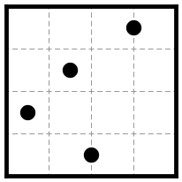</a>
    <a href="https://puzz.cipherpuzzles.com/p.html?midloop/4/4/i7fj7fhfn" target="_blank">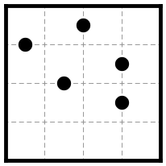</a>
    <a href="https://puzz.cipherpuzzles.com/p.html?midloop/4/4/gfn5fgfhfh" target="_blank">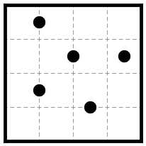</a>
     
    <a href="https://puzz.cipherpuzzles.com/p.html?midloop/4/4/sfh37fr" target="_blank">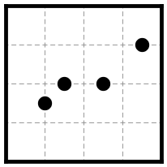</a>
    <a href="https://puzz.cipherpuzzles.com/p.html?midloop/4/4/iflfh5fq" target="_blank">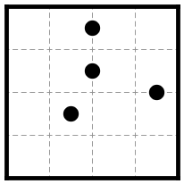</a>
    <a href="https://puzz.cipherpuzzles.com/p.html?midloop/4/4/s5fqfgf" target="_blank">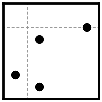</a>
    <a href="https://puzz.cipherpuzzles.com/p.html?midloop/4/4/ifhfofmf" target="_blank">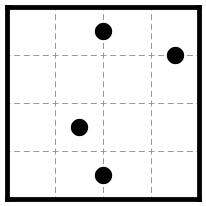</a>
    <a href="https://puzz.cipherpuzzles.com/p.html?midloop/4/4/ifmfjfkf" target="_blank">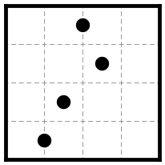</a>
    <a href="https://puzz.cipherpuzzles.com/p.html?midloop/4/4/gfmfifpf" target="_blank">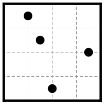</a>
    <a href="https://puzz.cipherpuzzles.com/p.html?midloop/4/4/sf3fgfo" target="_blank">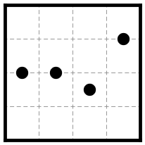</a>
    <a href="https://puzz.cipherpuzzles.com/p.html?midloop/4/4/ifhfo3fo" target="_blank">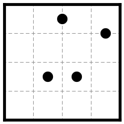</a>
    <a href="https://puzz.cipherpuzzles.com/p.html?midloop/4/4/ifr37fnf" target="_blank">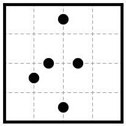</a>
    <a href="https://puzz.cipherpuzzles.com/p.html?midloop/4/4/wb3bfp" target="_blank">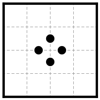</a>
    <a href="https://puzz.cipherpuzzles.com/p.html?midloop/4/4/wfk3fif" target="_blank">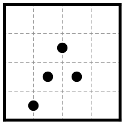</a>
    

## 答案

`DIY INSTRUCTION`

## 解析

_官方存档未填写解析。_

## 提示

### 1. 该如何提取

象形。最终答案的字母数是(3 11)。

## 本地附件

- [1dfaaf9fa434492d8d4d6034ca73947a.webp](../../../assets/archive.cipherpuzzles.com/ccbc13/images/asteroid/1dfaaf9fa434492d8d4d6034ca73947a.webp)
- [4580363c76e74330b964df0038bc0ac5.webp](../../../assets/archive.cipherpuzzles.com/ccbc13/images/asteroid/4580363c76e74330b964df0038bc0ac5.webp)
- [47ecabeed5e34edd9406bc43a6042baa.webp](../../../assets/archive.cipherpuzzles.com/ccbc13/images/asteroid/47ecabeed5e34edd9406bc43a6042baa.webp)
- [559ce26bafce460a8dd995f73accedd1.webp](../../../assets/archive.cipherpuzzles.com/ccbc13/images/asteroid/559ce26bafce460a8dd995f73accedd1.webp)
- [7dd5158203d94d299e49c35b6de3cc11.webp](../../../assets/archive.cipherpuzzles.com/ccbc13/images/asteroid/7dd5158203d94d299e49c35b6de3cc11.webp)
- [862d49e6bed546719f24f549dcb2fe9f.webp](../../../assets/archive.cipherpuzzles.com/ccbc13/images/asteroid/862d49e6bed546719f24f549dcb2fe9f.webp)
- [9340648032a34126a48644dd555689e7.webp](../../../assets/archive.cipherpuzzles.com/ccbc13/images/asteroid/9340648032a34126a48644dd555689e7.webp)
- [a42390c118c74d8f86f76a637e418659.webp](../../../assets/archive.cipherpuzzles.com/ccbc13/images/asteroid/a42390c118c74d8f86f76a637e418659.webp)
- [b0dbbe27c5c04a1781e816ca4a6b9a7e.webp](../../../assets/archive.cipherpuzzles.com/ccbc13/images/asteroid/b0dbbe27c5c04a1781e816ca4a6b9a7e.webp)
- [b672954ba1eb4b4296c35427f37bc622.webp](../../../assets/archive.cipherpuzzles.com/ccbc13/images/asteroid/b672954ba1eb4b4296c35427f37bc622.webp)
- [ba1692b75324449baacf1abffdf8e688.webp](../../../assets/archive.cipherpuzzles.com/ccbc13/images/asteroid/ba1692b75324449baacf1abffdf8e688.webp)
- [c16502cbe8564aa3808d826a8bf72132.webp](../../../assets/archive.cipherpuzzles.com/ccbc13/images/asteroid/c16502cbe8564aa3808d826a8bf72132.webp)
- [d63459543d254d9986570552f1af0269.webp](../../../assets/archive.cipherpuzzles.com/ccbc13/images/asteroid/d63459543d254d9986570552f1af0269.webp)
- [f80ce30e040c414bb9291e5a190ae805.webp](../../../assets/archive.cipherpuzzles.com/ccbc13/images/asteroid/f80ce30e040c414bb9291e5a190ae805.webp)

来源：[https://archive.cipherpuzzles.com/ccbc13/problems/asteroid/156.yaml](https://archive.cipherpuzzles.com/ccbc13/problems/asteroid/156.yaml)
