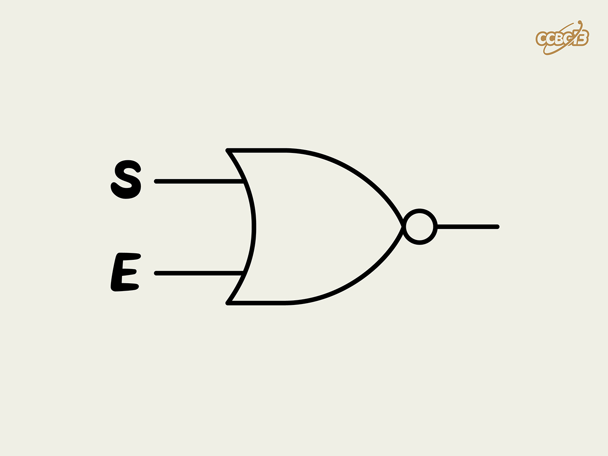

# ⭐

## 题面

## 答案

`SNORE`

## 解析

_官方存档未填写解析。_

## 提示

### 1. 我毫无头绪

搜索一下中间的逻辑门（logic gate）符号，你需要用这个逻辑门把两个字母连起来。

## 本地附件

- [73854d434e164b7fb91a97f45c3a0813.webp](../../../assets/archive.cipherpuzzles.com/ccbc13/images/asteroid/73854d434e164b7fb91a97f45c3a0813.webp)

来源：[https://archive.cipherpuzzles.com/ccbc13/problems/asteroid/157.yaml](https://archive.cipherpuzzles.com/ccbc13/problems/asteroid/157.yaml)
