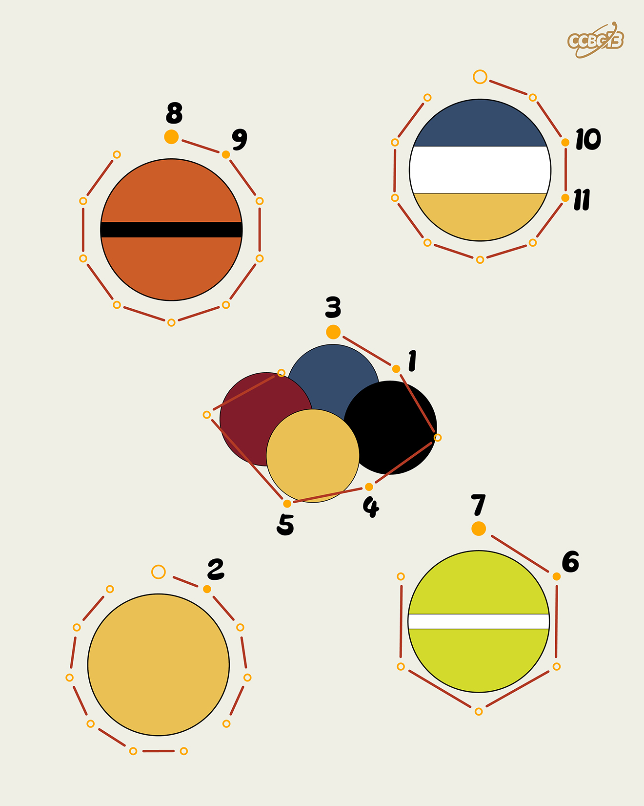

# ⭐

## 题面

## 答案

`RACQUETBALL`

## 解析

_官方存档未填写解析。_

## 提示

### 1. 我毫无头绪

每个球上的颜色代表了某个运动用球表面的颜色比例

### 2. 中间那个是什么

这种球比较少见，奥运会上仅在1900年出现过一次。

## 本地附件

- [0eb4bac243134c76b75c5d34beb39d32.webp](../../../assets/archive.cipherpuzzles.com/ccbc13/images/asteroid/0eb4bac243134c76b75c5d34beb39d32.webp)

来源：[https://archive.cipherpuzzles.com/ccbc13/problems/asteroid/159.yaml](https://archive.cipherpuzzles.com/ccbc13/problems/asteroid/159.yaml)
