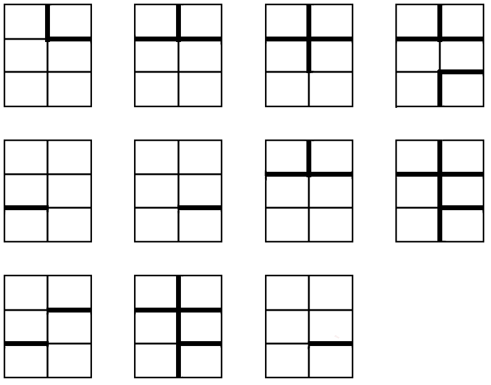

# ⭐️

## 题面

## 答案

`BOURGEOISIE`

## 解析

_官方存档未填写解析。_

## 提示

### 1. 我毫无头绪

如果两个相邻格子没有粗线阻挡，连接这两个格子的中心点。

## 本地附件

- [5e8ef78753d743d38d68625c97b1c49c.webp](../../../assets/archive.cipherpuzzles.com/ccbc13/images/asteroid/5e8ef78753d743d38d68625c97b1c49c.webp)

来源：[https://archive.cipherpuzzles.com/ccbc13/problems/asteroid/160.yaml](https://archive.cipherpuzzles.com/ccbc13/problems/asteroid/160.yaml)
