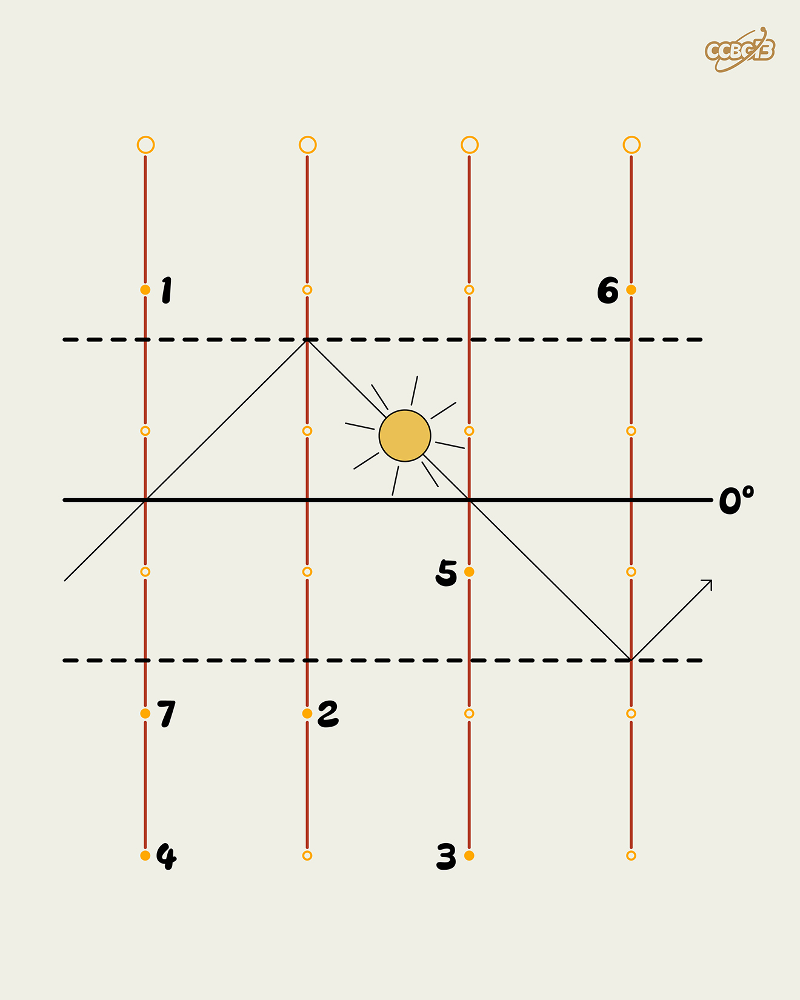

# ⭐

## 题面

## 答案

`PENGUIN`

## 解析

_官方存档未填写解析。_

## 提示

### 1. 我毫无思路

两条虚线代表了地球的两条回归线

## 本地附件

- [f4907ed018b646d2bcc3921a4a13e5c6.webp](../../../assets/archive.cipherpuzzles.com/ccbc13/images/asteroid/f4907ed018b646d2bcc3921a4a13e5c6.webp)

来源：[https://archive.cipherpuzzles.com/ccbc13/problems/asteroid/162.yaml](https://archive.cipherpuzzles.com/ccbc13/problems/asteroid/162.yaml)
