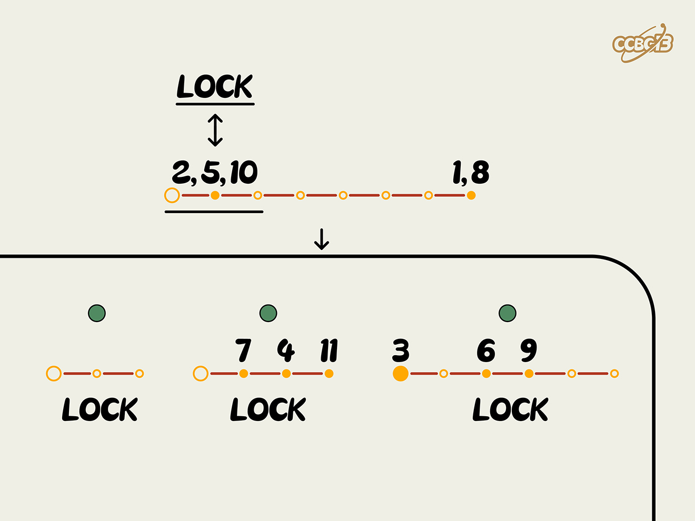

# ⭐

## 题面

## 答案

`DESPERADOES`

## 解析

_官方存档未填写解析。_

## 提示

### 1. 我毫无头绪

与 LOCK 相对的是 KEY，所以第一行是 KEYBOARD，需要在键盘上找三个 LOCK。

## 本地附件

- [1d8f3c683c1f4426aa004c8c09c85be1.webp](../../../assets/archive.cipherpuzzles.com/ccbc13/images/asteroid/1d8f3c683c1f4426aa004c8c09c85be1.webp)

来源：[https://archive.cipherpuzzles.com/ccbc13/problems/asteroid/163.yaml](https://archive.cipherpuzzles.com/ccbc13/problems/asteroid/163.yaml)
