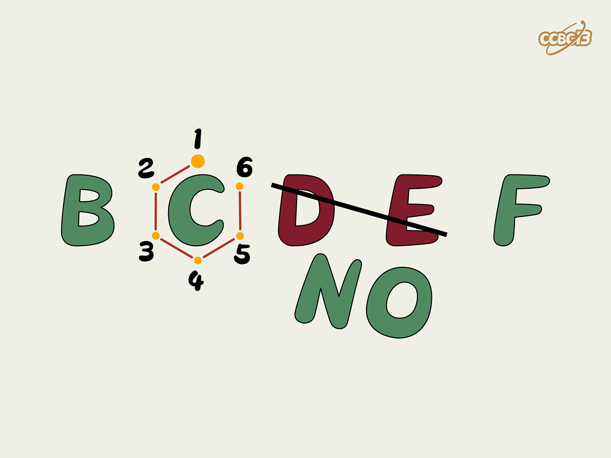

# ⭐

## 题面

## 答案

`CARBON`

## 解析

_官方存档未填写解析。_

## 提示

### 1. 我毫无思路

每个绿色字母代表一个化学元素

## 本地附件

- [42a229270c314203affcf9d51a3eefc4.webp](../../../assets/archive.cipherpuzzles.com/ccbc13/images/asteroid/42a229270c314203affcf9d51a3eefc4.webp)

来源：[https://archive.cipherpuzzles.com/ccbc13/problems/asteroid/164.yaml](https://archive.cipherpuzzles.com/ccbc13/problems/asteroid/164.yaml)
