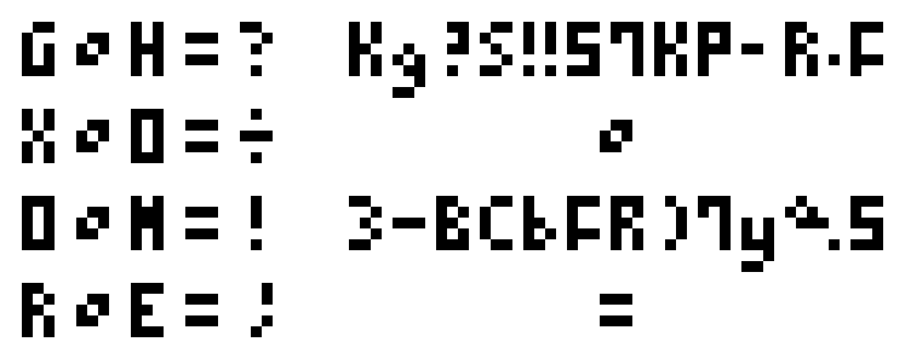

# ⭐

## 题面

## 答案

`CYLINDER ENGINE`

## 解析

_官方存档未填写解析。_

## 提示

### 1. 我毫无思路

将给出的两部分按像素异或

## 本地附件

- [8290490d5c364cc486239f795fde2c76.webp](../../../assets/archive.cipherpuzzles.com/ccbc13/images/asteroid/8290490d5c364cc486239f795fde2c76.webp)

来源：[https://archive.cipherpuzzles.com/ccbc13/problems/asteroid/165.yaml](https://archive.cipherpuzzles.com/ccbc13/problems/asteroid/165.yaml)
