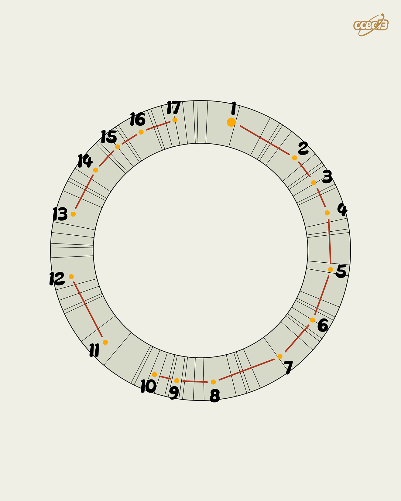

# ⭐

## 题面

## 答案

`PRINCIPLES OF FAITH`

## 解析

_官方存档未填写解析。_

## 提示

### 1. 我毫无思路

本题为摩斯密码

## 本地附件

- [499b3e0a38a442d3a2dfc2e7d3e505f6.webp](../../../assets/archive.cipherpuzzles.com/ccbc13/images/asteroid/499b3e0a38a442d3a2dfc2e7d3e505f6.webp)

来源：[https://archive.cipherpuzzles.com/ccbc13/problems/asteroid/166.yaml](https://archive.cipherpuzzles.com/ccbc13/problems/asteroid/166.yaml)
