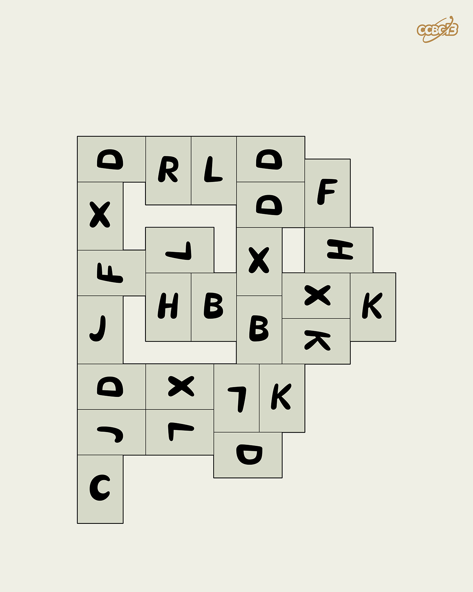

# ⭐

## 题面

## 答案

`CHERSONESUS`

## 解析

_官方存档未填写解析。_

## 提示

### 1. 我毫无头绪

每个字母占据一个 2x3 的方格，恰是盲文字母的比例，所以需要将每个字母换成对应的盲文填入方格。

## 本地附件

- [2824232c31b848ce9dce38e139a1421a.webp](../../../assets/archive.cipherpuzzles.com/ccbc13/images/asteroid/2824232c31b848ce9dce38e139a1421a.webp)

来源：[https://archive.cipherpuzzles.com/ccbc13/problems/asteroid/168.yaml](https://archive.cipherpuzzles.com/ccbc13/problems/asteroid/168.yaml)
