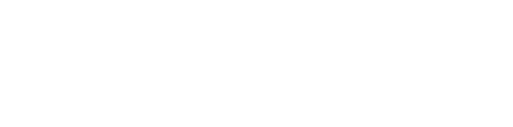

# ⭐

## 题面

## 答案

`PYREX`

## 解析

_官方存档未填写解析。_

## 提示

### 1. 我毫无头绪

每个图标代表了 MS Word 里常用的功能，它们都有相对应的快捷键。

## 本地附件

- [a75b91a1ebcc4472885e1cd9aa4db252.webp](../../../assets/archive.cipherpuzzles.com/ccbc13/images/asteroid/a75b91a1ebcc4472885e1cd9aa4db252.webp)

来源：[https://archive.cipherpuzzles.com/ccbc13/problems/asteroid/169.yaml](https://archive.cipherpuzzles.com/ccbc13/problems/asteroid/169.yaml)
