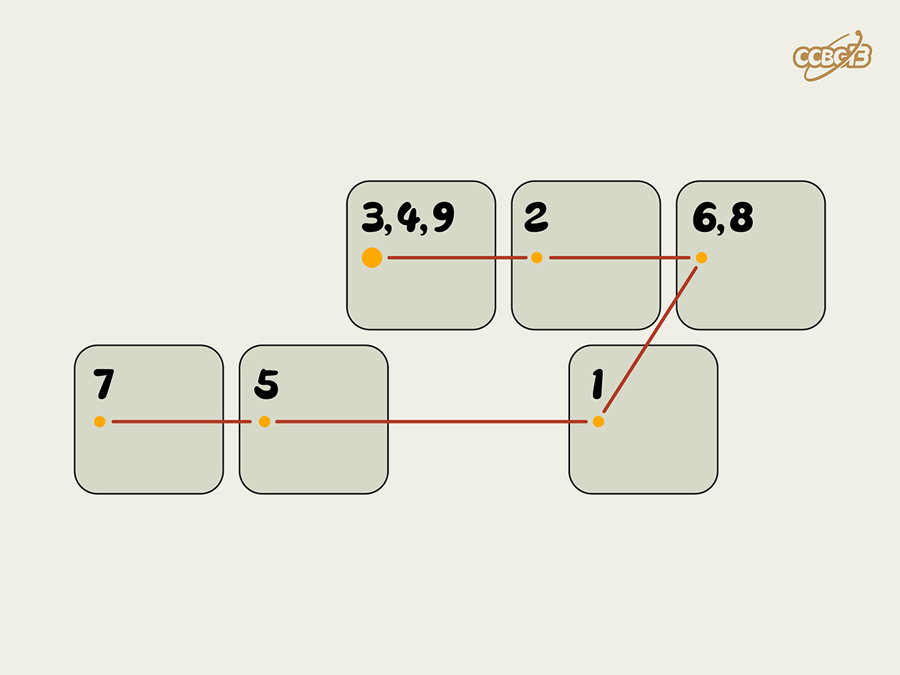

# ⭐

## 题面

## 答案

`FREE STATE`

## 解析

_官方存档未填写解析。_

## 提示

### 1. 我毫无头绪

这是键盘的一块区域，请找到这片区域并按数字顺序得到两个英文单词。

## 本地附件

- [e24812975cff469fbfa6bc2b0907b454.webp](../../../assets/archive.cipherpuzzles.com/ccbc13/images/asteroid/e24812975cff469fbfa6bc2b0907b454.webp)

来源：[https://archive.cipherpuzzles.com/ccbc13/problems/asteroid/170.yaml](https://archive.cipherpuzzles.com/ccbc13/problems/asteroid/170.yaml)
