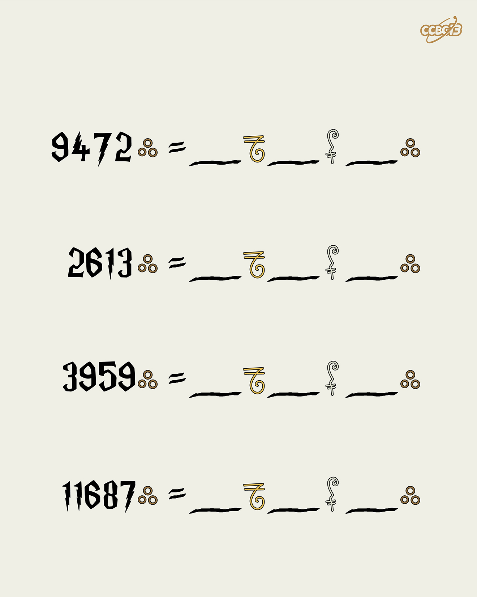

# ⭐

## 题面

## 答案

`SCREECH OWL`

## 解析

_官方存档未填写解析。_

## 提示

### 1. 我毫无头绪

这是哈利波特里的金钱换算

## 本地附件

- [30aca22f12b74e04a205a05014977f81.webp](../../../assets/archive.cipherpuzzles.com/ccbc13/images/asteroid/30aca22f12b74e04a205a05014977f81.webp)

来源：[https://archive.cipherpuzzles.com/ccbc13/problems/asteroid/171.yaml](https://archive.cipherpuzzles.com/ccbc13/problems/asteroid/171.yaml)
