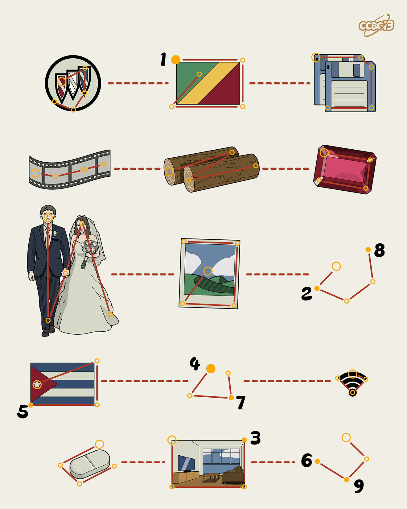

# ⭐️

## 题面

## 答案

`COMMANDER`

## 解析

_官方存档未填写解析。_

## 提示

### 1. 能否给我题目里图片代表的英文单词

BUICK CONGO DISKS

FILM LOGS RUBY

MARRY PHOTO

CUBA WIFI

PILL ROOM

### 2. 我还是不懂规律

中间的单词的第 n 个字母处于左右两边第 n 个字母之间的中点。

## 本地附件

- [3afc606120ce4bc5a3d4176e62a4c7cb.webp](../../../assets/archive.cipherpuzzles.com/ccbc13/images/asteroid/3afc606120ce4bc5a3d4176e62a4c7cb.webp)

来源：[https://archive.cipherpuzzles.com/ccbc13/problems/asteroid/173.yaml](https://archive.cipherpuzzles.com/ccbc13/problems/asteroid/173.yaml)
